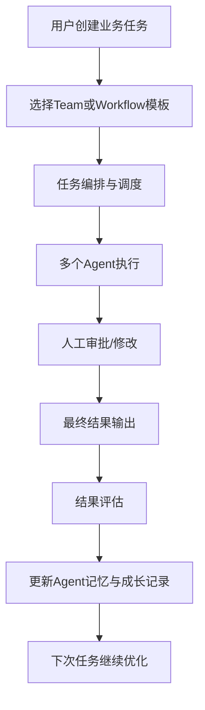

下面我给你一份**更完整、可直接交给架构师做系统设计**的 PRD 草案。
我会尽量做到两点：

1. **语言通俗易懂**
2. **结构足够详细，方便后续做系统设计、数据库设计、接口设计、页面设计**

你可以直接复制成 `PRD.md` 使用。

---

# AI 多 Agent 协作与成长平台 PRD

作者：jerry.guo
版本：v2.0
日期：2026-04-02
文档状态：产品需求草案（可用于系统设计输入）

---

# 1. 项目概述

## 1.1 项目名称

**AI 多 Agent 协作与成长平台**
英文可暂定：**AI Harness Platform**

---

## 1.2 项目背景

随着大模型能力不断增强，企业和创业团队已经不再满足于“和一个 AI 聊天”。
大家真正需要的是一个可以让 AI **像团队一样协作、像员工一样成长、像系统一样稳定运行**的平台。

在传统使用方式中，用户常常会遇到这些问题：

* 结果不稳定，同样的问题今天答得好，明天答得差
* 过程不可控，不知道 AI 为什么这么做
* 多个 AI 角色无法有效配合，容易重复、冲突、失控
* 没有长期记忆，AI 不知道自己以前做过什么、做得怎么样
* 缺少评估和优化机制，系统无法持续进步
* 关键环节没有人工把关，容易产出错误、高风险内容

所以我们希望建设一个平台，让用户可以：

* 设计多个 Agent
* 给每个 Agent 定义职责、能力、记忆和协作方式
* 让多个 Agent 以不同模式合作完成任务
* 在关键节点引入人工参与
* 记录每个 Agent 的表现和成长轨迹
* 通过评估系统持续优化整个 AI 团队

---

## 1.3 项目目标

本项目的目标不是做一个普通聊天工具，而是做一个：

> **可设计、可编排、可运行、可评估、可成长的 AI 多 Agent 协作平台**

平台最终要解决的是：

* **如何让 AI 从单点能力，升级为团队能力**
* **如何让 AI 从一次性回答，升级为可持续交付**
* **如何让 AI 从不可控工具，升级为生产系统**

---

## 1.4 产品定位

该产品定位为一个**面向企业和创业团队的 AI 协作中台/操作系统**。

它既可以服务于：

* 自媒体内容生产团队
* 产品与研发团队
* 客服和运营团队
* 咨询与分析团队

也可以作为企业内部 AI 能力平台，对接不同业务场景。

---

# 2. 产品愿景

我们的愿景是：

> 让企业像搭建一个真实团队一样，搭建一个 AI 团队；
> 让每个 Agent 有角色、有职责、有记忆、有成长；
> 让整个 AI 团队能稳定协作并持续进化。

---

# 3. 目标用户

## 3.1 主要用户角色

### 角色一：业务负责人 / 创业者

特点：

* 不一定懂底层技术
* 希望快速搭建一个可工作的 AI 团队
* 关注结果、效率、成本、质量

核心诉求：

* 我能不能用这个平台快速做出一个可运行的业务流程？
* 我能不能知道哪些 Agent 有用，哪些没用？
* 我能不能控制风险，避免错误结果直接上线？

---

### 角色二：产品经理

特点：

* 负责设计业务流程
* 需要定义 Agent 的职责、输入输出、协作方式
* 需要把复杂需求翻译成可执行流程

核心诉求：

* 我如何设计一个多 Agent 系统？
* 哪些流程适合串行？哪些适合并行？
* 如何把人工审批和自动化结合起来？

---

### 角色三：架构师 / 技术负责人

特点：

* 负责系统设计、服务拆分、数据模型、运行机制
* 需要清楚产品边界与核心能力

核心诉求：

* 系统有哪些核心模块？
* 任务流、状态机、记忆系统、评估系统怎么设计？
* 如何保证稳定性、可扩展性和可观测性？

---

### 角色四：运营 / 编辑 / 审核人员

特点：

* 在任务执行过程中需要人工介入
* 更关心内容质量、风险控制、最终发布

核心诉求：

* 我需要在哪些环节参与？
* 我怎么知道 AI 给出的结果靠不靠谱？
* 我怎么给 Agent 反馈，让它以后做得更好？

---

# 4. 典型业务场景

---

## 4.1 场景一：自媒体内容生产

一个自媒体创业团队，希望每天稳定地产出：

* 推文
* 小红书内容
* 视频脚本
* 选题方案
* 爆款复盘

他们希望平台帮他们完成：

1. 多个 Agent 共同找选题
2. 选择最优方向
3. 生成初稿
4. 做风格优化
5. 做平台适配
6. 做审核
7. 发布后做复盘
8. 根据数据让 Agent 越来越懂内容生产

---

## 4.2 场景二：产品需求到系统设计

一个创业团队希望把“产品想法”变成“产品 PRD”和“系统设计”。

他们希望平台帮他们完成：

1. 产品经理 Agent 整理业务目标
2. 审计 Agent 检查 PRD 是否完整
3. 架构师 Agent 产出技术方案
4. 架构评审 Agent 检查方案是否合理
5. 人工进行最终确认

---

## 4.3 场景三：企业知识问答与分析

企业希望多个 Agent 协作完成：

* 资料检索
* 结论整理
* 风险分析
* 报告生成
* 审核与归档

---

# 5. 核心设计理念

本产品设计遵循以下原则：

## 5.1 Agent 不是 Prompt，而是“岗位角色”

每个 Agent 不是一段提示词，而是一个具备以下要素的角色：

* 身份
* 职责
* 能力
* 边界
* 输入输出
* 协作关系
* 历史表现
* 成长记录

---

## 5.2 多 Agent 不是固定流程，也不是无序群聊

多 Agent 协作不能只有一种方式。
平台需要支持不同的协作模式，包括：

* 串行流程
* 并行分工
* 头脑风暴
* 主控拆任务
* 审核裁决

---

## 5.3 先发散，再收敛

很多复杂任务不适合直接进入固定流程。
平台应支持：

* 前期开放式探索
* 中期方案收敛
* 后期流程化执行

---

## 5.4 稳定性优先于炫技

系统必须优先保证：

* 输出结构化
* 状态可追踪
* 失败可恢复
* 结果可审核
* 过程可回放

---

## 5.5 成长依赖数据闭环，而不是只改 Prompt

每个 Agent 的成长必须来源于：

* 历史任务记录
* 结果表现数据
* 人工反馈
* 错误分类
* 评估体系
* 持续优化

---

# 6. 产品范围

---

## 6.1 本期要解决的问题

本期平台重点解决以下问题：

1. 如何定义和管理多个 Agent
2. 如何设计多 Agent 协作流程
3. 如何管理任务执行过程
4. 如何引入人工参与
5. 如何为 Agent 提供记忆
6. 如何记录表现并推动成长
7. 如何评估整个系统运行质量

---

## 6.2 本期暂不解决的问题

以下内容可放到后续版本：

* 自动训练/微调模型
* 完全自主进化，不经人工审核自动改策略
* 跨组织复杂权限体系
* 超复杂低代码 marketplace 生态
* 大规模第三方插件市场

---

# 7. 核心概念定义

---

## 7.1 Agent

平台中的基础执行单元。
每个 Agent 代表一个专业角色，例如：

* 选题 Agent
* 写作 Agent
* 审核 Agent
* 架构师 Agent
* PRD 审计 Agent

每个 Agent 都必须有明确的：

* 角色定义
* 职责边界
* 输入输出
* 可用工具
* 可访问知识
* 协作关系

---

## 7.2 Team

多个 Agent 组成一个 Team，用于完成一类业务任务。

例如“内容生产团队”可以包含：

* 选题 Agent
* 写作 Agent
* 风格优化 Agent
* 审核 Agent
* 数据复盘 Agent

---

## 7.3 Task

Task 是一次具体任务，例如：

* 生成一篇关于 AI Agent 的推文
* 输出一份产品 PRD
* 对某个 PRD 做审计
* 生成一个短视频脚本

---

## 7.4 Workflow

Workflow 是任务在执行时的流转路径，例如：

* A → B → C 的串行流程
* A/B/C 并行处理后汇总
* 多个 Agent brainstorm 后由 Moderator 决策

---

## 7.5 Memory

Memory 是平台为 Agent 提供的记忆能力，包括：

### Task Memory

当前任务上下文和执行现场信息

### Agent Memory

该 Agent 历史做过什么、做得怎么样

### Team Memory

团队共享规范、知识、案例、经验

---

## 7.6 Human-in-the-loop

指在关键节点引入人工参与，用于：

* 选择方向
* 审核结果
* 修改内容
* 做最终批准
* 对系统提供反馈

---

## 7.7 Eval

Eval 是评估系统，用于衡量：

* Agent 输出质量
* 协作流程效果
* 人工干预情况
* 系统是否在进步

---

# 8. 产品整体架构

---

## 8.1 总体结构

平台从产品层面可分为以下模块：

1. Agent 设计台
2. Team 设计台
3. 协作编排系统
4. 任务运行系统
5. 记忆系统
6. 人工参与系统
7. 评估系统
8. 可观测系统
9. 成长与优化系统

---

## 8.2 总体流程



---

# 9. 核心模块详细需求

---

# 9.1 Agent 设计台

## 9.1.1 模块目标

让用户可以像配置“岗位”一样配置 Agent。

---

## 9.1.2 Agent 基本信息

每个 Agent 必须支持以下字段：

* Agent 名称
* Agent 描述
* 所属 Team
* 角色类型
* 当前版本
* 状态（启用/停用/测试中）
* 创建人
* 更新时间

---

## 9.1.3 角色定义

用户需要能够填写：

* 你是谁
* 你负责什么
* 你不负责什么
* 你擅长什么
* 你的工作目标是什么

示例：

```markdown
角色名称：PRD审计Agent

角色描述：
你是一名高级产品审计专家，负责检查PRD是否完整、清晰、可执行。

负责内容：
- 检查需求背景是否清晰
- 检查目标用户是否明确
- 检查功能描述是否完整
- 检查验收标准是否明确

不负责内容：
- 不负责输出系统架构设计
- 不负责生成开发计划
```

---

## 9.1.4 Prompt 配置

Prompt 不能只是一大段文本，应该结构化拆分。

### 应支持的 Prompt 类型：

#### 1. System Prompt

定义最高层规则和行为原则

#### 2. Role Prompt

定义该 Agent 的角色身份

#### 3. Task Template

定义当前任务模板

#### 4. Constraint Prompt

定义限制条件，例如：

* 不能编造事实
* 必须结构化输出
* 必须优先引用知识库内容

#### 5. Output Schema

定义输出格式，例如：

* Markdown
* JSON
* Checklist
* Scorecard

#### 6. Few-shot 示例

定义高质量参考样例

---

## 9.1.5 工具配置

用户应能够为每个 Agent 配置可调用工具，例如：

* 搜索工具
* 知识库检索
* 数据查询
* API 调用
* 代码执行
* 文档生成
* 图表生成

每个工具应支持：

* 工具名称
* 工具说明
* 输入参数定义
* 输出结构定义
* 权限控制
* 调用限制

---

## 9.1.6 知识配置

支持为 Agent 绑定知识来源，例如：

* RAG 知识库
* 文档库
* 案例库
* 风格规范库
* 业务规则库

---

## 9.1.7 行为策略配置

平台需要支持 Agent 的执行策略配置，包括：

* 单轮回答
* 多轮推理
* ReAct
* Planner-Executor
* Critic-Refiner
* Debate
* Self-check

可配置项包括：

* 最大步数
* 最大重试次数
* 是否自检
* 是否允许拆分子任务
* 是否允许调用下游 Agent

---

## 9.1.8 输入输出定义

每个 Agent 应支持定义：

### 输入

* 来自用户
* 来自上游 Agent
* 来自知识库
* 来自任务上下文

### 输出

* 正文内容
* 结构化结果
* 评分结果
* 审计意见
* 决策建议

---

## 9.1.9 版本管理

平台应支持查看 Agent 历史版本，包括：

* Prompt 变更
* 工具变更
* 策略变更
* 权限变更
* 变更说明
* 发布时间

---

# 9.2 Team 设计台

## 9.2.1 模块目标

让用户把多个 Agent 组织成一个业务团队。

---

## 9.2.2 Team 基本信息

* Team 名称
* Team 描述
* 适用场景
* 包含 Agent 列表
* 默认协作模式
* 默认任务模板

---

## 9.2.3 Team 角色划分

应支持配置：

* 谁负责发散探索
* 谁负责正式生成
* 谁负责审核
* 谁负责汇总
* 谁负责最终裁决

---

## 9.2.4 Team 模板

平台应预置 Team 模板，例如：

* 自媒体内容团队
* 产品设计团队
* 技术架构团队
* 报告分析团队

---

# 9.3 协作编排系统

## 9.3.1 模块目标

让用户定义多个 Agent 如何协作，而不是只能做单一聊天。

---

## 9.3.2 协作模式

平台应至少支持以下协作模式：

---

### 模式一：串行流程

适用于强依赖任务。

例如：

* 选题 → 写作 → 风格优化 → 审核 → 发布

特点：

* 顺序清晰
* 可控
* 适合生产型任务

---

### 模式二：并行分工

适用于可拆成多个独立维度的任务。

例如：

* 安全 Agent、性能 Agent、成本 Agent 并行审查同一份方案

特点：

* 速度快
* 视角多
* 需要汇总节点

---

### 模式三：Brainstorm

适用于探索型任务。

例如：

* 多个选题 Agent 提出不同方向
* 多个方案 Agent 讨论不同解法

特点：

* 发散
* 创意多
* 需要后续收敛

---

### 模式四：Supervisor-Worker

适用于复杂任务。

由一个主控 Agent：

* 拆解任务
* 分配任务
* 收集结果
* 汇总输出

---

### 模式五：Review / Judge

适用于高风险决策场景。

多个 Agent 各自输出方案，再由 Judge Agent 或人工裁决。

---

## 9.3.3 编排节点类型

流程设计台应支持以下节点：

* 开始节点
* Agent 执行节点
* 并行分支节点
* 汇总节点
* 审核节点
* 人工审批节点
* 条件判断节点
* 重试节点
* 结束节点

---

## 9.3.4 条件流转

应支持按条件流转，例如：

* 如果审核通过，则进入发布
* 如果审核不通过，则返回写作
* 如果分数低于阈值，则进入人工审批
* 如果生成失败超过 N 次，则任务失败

---

## 9.3.5 流程模板

平台应支持保存和复用流程模板。

例如：

* 内容生产标准流程
* PRD 生成与审计流程
* 架构设计流程

---

# 9.4 任务运行系统

## 9.4.1 模块目标

保证任务可以稳定运行、可追踪、可恢复。

---

## 9.4.2 任务生命周期

任务需要有清晰状态。

建议状态包括：

* CREATED
* READY
* RUNNING
* WAITING_HUMAN
* REVIEWING
* RETRYING
* DONE
* FAILED
* CANCELED

---

## 9.4.3 Agent 执行状态

每个 Agent 节点也应有独立状态，例如：

* PENDING
* RUNNING
* SUCCESS
* FAILED
* RETRYING
* SKIPPED

---

## 9.4.4 重试机制

平台应支持：

* 自动重试
* 人工触发重试
* 从失败节点继续执行
* 从某个中间节点重跑

---

## 9.4.5 降级机制

当某个 Agent 多次失败时，应支持：

* 切换备用模型
* 切换备用 Prompt
* 切换模板化输出
* 转人工处理

---

## 9.4.6 超时与异常处理

应支持：

* Agent 执行超时
* Tool 调用超时
* 模型接口失败
* 输出不符合 schema
* 上下文缺失

---

# 9.5 Memory 系统

## 9.5.1 模块目标

为 Agent 提供长期稳定的“记忆感”。

---

## 9.5.2 Task Memory

存储当前任务相关上下文，例如：

* 原始任务目标
* 中间结果
* 上游输出
* 当前版本内容
* 审核意见
* 当前轮次

---

## 9.5.3 Agent Memory

存储单个 Agent 的历史履历和能力画像。

建议包含：

* 历史任务数
* 一次通过率
* 平均评分
* 常见失败原因
* 擅长领域
* 薄弱领域
* 最近改进建议

---

## 9.5.4 Team Memory

存储团队共享知识，例如：

* SOP
* 风格规范
* 常见问题库
* 成功案例库
* 失败案例库
* 品牌手册
* 平台规则

---

## 9.5.5 Memory 注入策略

平台应支持配置：

* 哪些任务上下文在执行时注入
* 哪些历史经验在执行时注入
* 哪些团队规范在执行时注入

要避免无节制地把全部记忆塞进去，造成上下文污染。

---

# 9.6 Human-in-the-loop

## 9.6.1 模块目标

在关键节点引入人工，平衡自动化与质量控制。

---

## 9.6.2 典型人工介入点

### 自媒体场景

* 选题选择
* 发布前审核
* 高风险内容确认
* 重大方向调整

### 产品设计场景

* PRD 定稿
* 架构方案定稿
* 高风险技术决策

---

## 9.6.3 审批动作

人工节点应支持：

* 通过
* 驳回
* 修改后通过
* 给反馈意见
* 指定退回节点

---

## 9.6.4 反馈沉淀

人工的每次反馈都不应只是这次任务用完就丢。
应进入：

* Agent 反馈记录
* 错误分类样本
* 经验库
* 后续优化建议

---

# 9.7 Eval 评估系统

## 9.7.1 模块目标

判断系统是否真的有效，而不是只看“感觉还行”。

---

## 9.7.2 评估对象

评估对象包括：

* 单个 Agent
* 某个 Workflow
* 某个 Team
* 某个业务场景
* 某个版本更新效果

---

## 9.7.3 评估维度

### 通用维度

* 正确性
* 完整性
* 一致性
* 结构化程度
* 可执行性
* 延迟
* 成本

### 内容场景维度

* 标题吸引力
* 开头强度
* 信息密度
* 风格一致性
* 平台适配度

### 文档场景维度

* 逻辑清晰度
* 需求完整度
* 边界说明
* 验收标准明确性

---

## 9.7.4 评估方式

平台应支持：

* 规则评估
* LLM 评估
* 人工评分
* 业务结果评估

---

## 9.7.5 A/B 测试

平台应支持对比：

* Prompt A vs Prompt B
* Workflow A vs Workflow B
* Agent 版本 A vs 版本 B

---

# 9.8 可观测系统

## 9.8.1 模块目标

让系统从黑盒变成白盒。

---

## 9.8.2 Trace

应记录每一步：

* 输入
* Prompt
* 使用的记忆
* Tool 调用
* 输出
* 决策原因
* 耗时
* 成本

---

## 9.8.3 Replay

支持回放一次任务的完整过程，用于：

* 排查问题
* 复盘
* 重现错误
* 审计

---

## 9.8.4 Dashboard

平台应提供核心看板：

* 任务成功率
* 一次通过率
* 人工介入率
* Agent 平均分
* 失败原因分布
* 执行耗时
* 成本分布

---

# 9.9 Agent 成长系统

## 9.9.1 模块目标

让每个 Agent 都有成长记录，而不是静态配置。

---

## 9.9.2 成长来源

每个 Agent 的成长要基于：

* 历史任务记录
* 审核反馈
* 人工修改记录
* Eval 评分
* 业务结果表现

---

## 9.9.3 成长画像

系统应为每个 Agent 生成成长档案，包括：

* 最近表现趋势
* 擅长任务类型
* 薄弱任务类型
* 常见问题模式
* 最近一次优化建议
* 最近一次版本变更效果

---

## 9.9.4 优化建议

系统可生成半自动优化建议，例如：

* 建议增加更多 few-shot 示例
* 建议限制输出长度
* 建议拆出一个专门的 Hook Agent
* 建议增加人工审核节点
* 建议切换协作模式

注意：
系统可以给建议，但默认不直接自动修改生产配置，避免风险失控。

---

# 10. 自媒体场景详细流程示例

为了让架构师更容易理解，这里给出一个完整业务示例。

---

## 10.1 目标

目标：产出一条高质量 AI 主题内容，并通过数据复盘持续优化。

---

## 10.2 涉及 Agent

* 选题 Agent
* 趋势 Agent
* 用户洞察 Agent
* Moderator Agent
* 写作 Agent
* 风格优化 Agent
* 审核 Agent
* 数据复盘 Agent

---

## 10.3 执行流程

### 阶段一：发散探索

1. 选题 Agent 提候选选题
2. 趋势 Agent 提近期热点方向
3. 用户洞察 Agent 提用户关注点
4. Moderator Agent 汇总并选题

### 阶段二：正式生产

5. 写作 Agent 生成初稿
6. 风格优化 Agent 调整成目标风格
7. 审核 Agent 检查结构、质量和风险
8. 如不通过，回退到写作或优化节点

### 阶段三：人工确认

9. 人工编辑查看最终版本
10. 通过后发布

### 阶段四：结果复盘

11. 数据复盘 Agent 获取内容表现数据
12. 评估哪些部分有效、哪些部分无效
13. 更新相关 Agent 的成长记录

---

## 10.4 协作模式说明

* 发散阶段：并行 + brainstorm
* 决策阶段：Moderator 收敛
* 生产阶段：串行 workflow
* 审核阶段：Agent + 人工
* 复盘阶段：并行分析 + 经验沉淀

---

# 11. 页面与信息架构建议

---

## 11.1 一级导航建议

* 工作台
* Agent 管理
* Team 管理
* Workflow 编排
* 任务中心
* 审批中心
* 记忆中心
* Eval 中心
* 观测中心
* 设置

---

## 11.2 核心页面说明

### 工作台

展示：

* 最近任务
* 任务状态
* 待审批任务
* 团队健康度
* Agent 运行情况

---

### Agent 管理

展示：

* Agent 列表
* Agent 基本信息
* Prompt 配置
* 工具配置
* 知识配置
* 历史版本
* 成长画像

---

### Team 管理

展示：

* Team 列表
* Team 成员
* 默认流程
* 协作模式
* 业务场景

---

### Workflow 编排

展示：

* 节点拖拽编排
* 节点配置
* 条件分支
* 审批节点
* 模板保存

---

### 任务中心

展示：

* 任务列表
* 当前状态
* 执行链路
* 输入输出
* 失败原因
* 重跑入口

---

### 审批中心

展示：

* 待人工审核任务
* 审批动作
* 审批意见
* 退回路径

---

### Eval 中心

展示：

* 各 Agent 分数
* 各流程表现
* 错误分布
* A/B 对比结果

---

### 观测中心

展示：

* trace
* replay
* 日志
* 成本
* 耗时

---

# 12. 权限与角色

建议初期支持以下角色：

## 12.1 管理员

* 管理 Agent、Team、Workflow
* 查看全部任务
* 配置系统参数

## 12.2 产品经理

* 创建和调整流程
* 配置 Agent
* 查看评估结果

## 12.3 运营 / 编辑

* 查看任务结果
* 审核和修改内容
* 提供人工反馈

## 12.4 观察者

* 只读查看数据与结果

---

# 13. 非功能需求

---

## 13.1 稳定性

* 支持失败重试
* 支持断点续跑
* 支持人工接管
* 支持流程降级

---

## 13.2 可扩展性

* Agent 可扩展
* Tool 可扩展
* Workflow 可扩展
* Memory 存储可扩展
* 模型可替换

---

## 13.3 可观测性

* 全链路 trace
* 全量日志记录
* replay
* 指标监控

---

## 13.4 安全性

* 权限控制
* 数据脱敏
* 高风险动作审批
* 日志审计

---

## 13.5 性能要求

初期可先满足：

* 单任务从启动到执行完成状态清晰可追踪
* Agent 节点平均响应在可接受范围
* 核心页面可支持团队日常操作

具体性能指标可由架构师结合部署规模设计。

---

# 14. 数据对象建议

下面给架构师一个产品层面的数据对象建议。

---

## 14.1 Agent

字段建议：

* id
* name
* description
* role_definition
* responsibility
* non_responsibility
* prompt_config
* strategy_config
* tool_bindings
* knowledge_bindings
* status
* version
* created_by
* created_at
* updated_at

---

## 14.2 Team

字段建议：

* id
* name
* description
* scenario_type
* default_collaboration_mode
* owner
* created_at
* updated_at

---

## 14.3 TeamAgentRelation

字段建议：

* team_id
* agent_id
* role_in_team
* sort_order
* is_required

---

## 14.4 Workflow

字段建议：

* id
* name
* description
* team_id
* workflow_definition
* status
* version

---

## 14.5 Task

字段建议：

* id
* task_type
* business_scenario
* input_payload
* current_status
* workflow_id
* team_id
* created_by
* created_at
* finished_at

---

## 14.6 TaskStep

字段建议：

* id
* task_id
* node_id
* node_type
* agent_id
* status
* input_payload
* output_payload
* retry_count
* started_at
* finished_at

---

## 14.7 ApprovalRecord

字段建议：

* id
* task_id
* step_id
* approver
* action
* comment
* approved_at

---

## 14.8 AgentPerformanceProfile

字段建议：

* agent_id
* total_tasks
* pass_rate
* avg_score
* avg_latency
* common_fail_reasons
* strengths
* weaknesses
* last_updated_at

---

## 14.9 AgentFeedback

字段建议：

* id
* agent_id
* source_type
* source_id
* feedback_type
* feedback_content
* created_at

---

## 14.10 TraceLog

字段建议：

* id
* task_id
* step_id
* event_type
* event_payload
* created_at

---

# 15. 关键业务规则

---

## 15.1 Agent 不能无边界工作

每个 Agent 必须有职责和非职责定义。

---

## 15.2 高风险任务必须支持人工审批

例如：

* 对外发布内容
* 高风险业务判断
* 关键文档定稿

---

## 15.3 所有关键节点必须可追踪

包括：

* Prompt
* 输入
* 输出
* 审批动作
* 回退原因

---

## 15.4 Memory 不能无限注入

必须支持筛选和注入策略，避免上下文污染。

---

## 15.5 成长建议默认半自动

系统可以建议优化，但不默认自动修改生产配置。

---

# 16. 用户故事

---

## 16.1 作为创业者

我希望快速搭建一个“内容团队”，这样我可以用多个 Agent 帮我稳定生产内容，而不是每次都从头写 Prompt。

---

## 16.2 作为产品经理

我希望定义不同 Agent 的职责和协作流程，这样我可以把一个复杂业务任务拆成多个稳定步骤。

---

## 16.3 作为编辑

我希望在发布前看到 AI 产出的最终结果并进行审核，这样我可以降低风险。

---

## 16.4 作为架构师

我希望系统有明确的任务流、状态机、记忆模型和日志链路，这样我可以设计出可扩展、可恢复的系统。

---

## 16.5 作为运营负责人

我希望知道哪个 Agent 表现好、哪个 Agent 表现差，这样我可以持续优化团队能力。

---

# 17. 验收标准

---

## 17.1 Agent 管理

* 可以创建、编辑、启停 Agent
* 可以配置 Prompt、工具、知识和策略
* 可以查看历史版本

---

## 17.2 Team 管理

* 可以创建 Team
* 可以将多个 Agent 组织成 Team
* 可以配置角色分工和默认协作模式

---

## 17.3 Workflow

* 可以配置串行、并行、审核、人工审批节点
* 可以保存和复用流程模板
* 可以按条件回退和流转

---

## 17.4 任务运行

* 可以创建任务并运行
* 可以查看任务执行状态
* 可以看到失败节点
* 可以重试和重跑

---

## 17.5 Human-in-the-loop

* 可以在指定节点进入人工审批
* 可以通过、驳回、修改并记录意见

---

## 17.6 Memory

* 可以记录任务记忆、Agent 记忆、团队记忆
* 任务执行时可按策略注入记忆

---

## 17.7 Eval

* 可以对 Agent 和流程进行评分
* 可以查看基础质量指标
* 可以进行基础版本对比

---

## 17.8 可观测

* 可以查看 trace
* 可以 replay 关键任务
* 可以看到主要指标

---

# 18. 版本规划建议

---

## Phase 1：MVP

目标：先跑通一个业务场景

功能范围：

* Agent 管理
* Team 管理
* 基础串行 Workflow
* 基础任务运行
* 人工审批节点
* 简单 trace
* 简单 Agent 履历

---

## Phase 2：标准化协作

目标：让多 Agent 协作可真正落地

功能范围：

* 并行/brainstorm 模式
* 更丰富的节点类型
* Team 模板
* 更完善的 Memory
* 更完善的审核与回退

---

## Phase 3：评估与成长

目标：让系统可以持续优化

功能范围：

* Eval 中心
* Agent 成长画像
* A/B 测试
* 错误分类
* 优化建议

---

## Phase 4：平台化

目标：形成企业级 AI 中台

功能范围：

* 多场景模板市场
* 更复杂权限体系
* 更强策略推荐
* 更细粒度成本治理

---

# 19. 风险与难点

---

## 19.1 难点一：多 Agent 容易失控

需要通过：

* 职责边界
* 协作模式
* 审核节点
* trace

来解决。

---

## 19.2 难点二：记忆过多会污染上下文

需要有记忆筛选和注入策略。

---

## 19.3 难点三：成长系统容易流于形式

必须把：

* 历史任务
* 人工反馈
* 评估结果
* 业务数据

真正接起来。

---

## 19.4 难点四：自动优化有风险

系统初期只建议，不直接自动改生产配置。

---

# 20. 总结

本产品要做的，不是一个“会聊天的 AI 页面”，而是一个：

* 能定义角色
* 能组织团队
* 能编排协作
* 能稳定运行
* 能人工介入
* 能记录记忆
* 能持续成长

的 **AI 多 Agent 协作平台**。

一句话总结：

> **把 AI 从单个回答器，升级为一个可管理、可协作、可成长的数字团队。**

---

如果你愿意，我下一步可以继续把这份 PRD 往下补成两份你会更好用的文档之一：

**第一份：系统设计输入版 PRD**
会补充更详细的：

* 模块边界
* 状态机
* 数据流
* 关键接口草图
* 异常流程

**第二份：自媒体场景专项 PRD**
会专门针对你刚才讲的“内容创业团队”做一版非常具体的业务方案。
