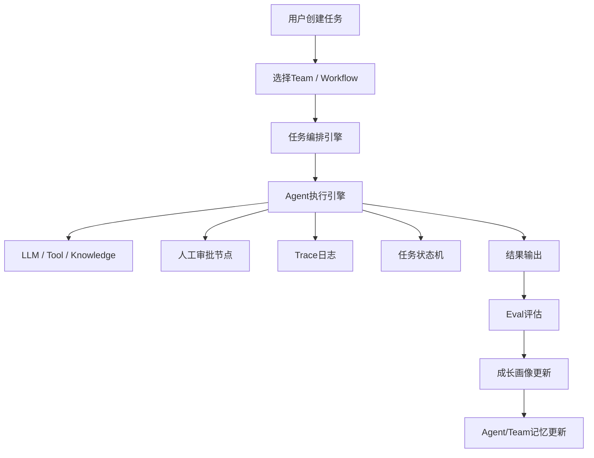
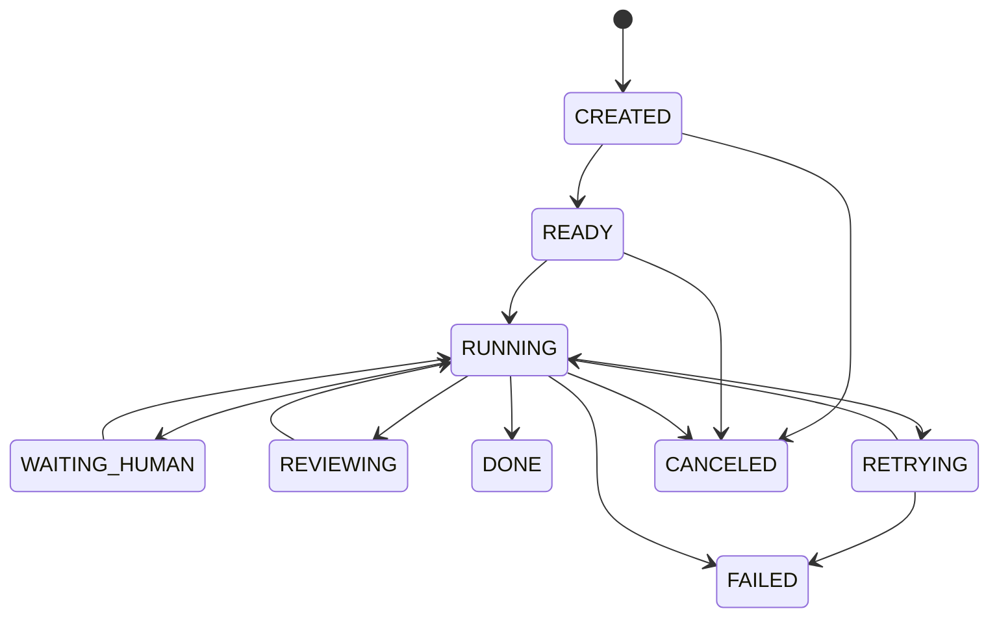
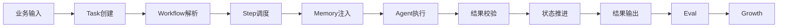
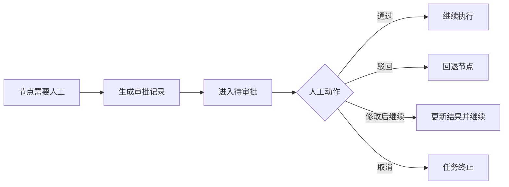

# AI 多 Agent 协作平台 PRD（系统设计输入版）

作者：jerry.guo
版本：v3.0
日期：2026-04-02
文档状态：系统设计输入版
适用对象：产品经理 / 架构师 / 技术负责人 / 核心研发

---

# 1. 文档目的

本文档用于作为 **AI 多 Agent 协作平台** 的系统设计输入。
目标不是停留在产品概念层，而是把产品需求整理成一份能够指导架构师进行以下工作的基础文档：

* 系统模块拆分
* 服务边界设计
* 数据模型设计
* 状态机设计
* 核心接口设计
* 异常与回退机制设计
* 可观测与治理设计

本文档默认读者已经理解：

* Agent 是具有角色、职责、能力、记忆、协作关系的执行单元
* 多 Agent 平台不是单纯对话系统，而是一个任务运行系统
* 平台要兼顾自动化、稳定性、可追踪性、人工介入和成长闭环

---

# 2. 项目概述

## 2.1 项目名称

**AI 多 Agent 协作平台**
英文名暂定：**AI Harness Platform**

---

## 2.2 项目背景

随着大模型逐渐进入企业生产场景，单 Agent 或单 Prompt 的方式已经无法支撑复杂任务。企业和创业团队在实际使用中会遇到以下问题：

1. AI 输出不稳定
   同样的任务，不同时间、不同上下文下输出差异明显，无法直接纳入业务流程。

2. 多角色协作困难
   一个复杂任务往往需要多个角色参与，例如产品、审计、架构、写作、审核、复盘等。现有系统很难定义他们之间的边界与协作关系。

3. 缺少过程管理
   多数 AI 应用只关注输入和输出，忽略中间步骤、决策过程、失败节点、回退路径，导致问题无法排查。

4. 缺少长期记忆与成长机制
   AI 不知道自己以前做过什么、做得怎么样、哪类任务擅长、哪类任务容易失败。

5. 人工介入方式粗糙
   通常只有“AI不行了就人工接管”，缺少明确的人在环设计。

因此需要建设一个平台，让用户可以像搭建真实团队一样搭建 AI 团队，并让这个团队具备：

* 角色分工
* 协作能力
* 任务管理能力
* 稳定运行能力
* 评估能力
* 成长能力

---

## 2.3 项目目标

本项目目标是构建一个平台，使用户能够完成以下闭环：

```text
定义Agent → 组织Team → 编排Workflow → 执行任务 → 人工介入 → 评估结果 → 更新记忆 → 持续优化
```

该平台本质上是一个 **AI 协作运行中台**，而不是一个简单聊天界面。

---

# 3. 产品定位

## 3.1 产品定位

平台定位为一个面向企业和创业团队的 **多 Agent 运行与协作平台**。

它要解决的是：

* 如何把一个复杂业务任务拆成多个 Agent 协作完成
* 如何让任务可执行、可追踪、可回放、可恢复
* 如何让 Agent 具备记忆和成长能力
* 如何在关键节点引入人工控制风险

---

## 3.2 产品边界

本期产品重点解决：

* Agent 的定义与管理
* Team 的定义与管理
* Workflow 编排
* 任务运行
* 记忆管理
* 人工审批
* 评估与成长
* 可观测与追踪

本期不重点解决：

* 模型训练 / 微调平台
* 第三方插件生态市场
* 超复杂多组织权限域
* 全自动自我改写生产策略

---

# 4. 目标用户与使用角色

## 4.1 业务负责人 / 创业者

核心诉求：

* 我能不能搭一个 AI 团队来完成业务任务
* 我能不能在关键点控制质量和风险
* 我能不能看到这个团队是否在进步

---

## 4.2 产品经理

核心诉求：

* 我如何定义 Agent 的职责与协作关系
* 我如何把业务流程翻译成多 Agent 执行流程
* 我如何设计人工介入点和回退规则

---

## 4.3 架构师 / 技术负责人

核心诉求：

* 模块边界是什么
* 核心状态机如何设计
* 任务流、记忆流、审批流、评估流如何打通
* 如何保证平台可扩展、可恢复、可观测

---

## 4.4 运营 / 编辑 / 审核人员

核心诉求：

* 我什么时候需要介入
* 我如何看到 AI 产出的内容与过程
* 我给出的反馈如何沉淀为系统经验

---

# 5. 核心场景

---

## 5.1 场景一：自媒体内容生产

目标：围绕某个主题产出高质量内容，并持续根据数据表现优化内容团队。

涉及流程：

* 多 Agent 并行 brainstorm 选题
* Moderator 收敛选题
* 写作 Agent 生成初稿
* 风格优化 Agent 调整输出
* 审核 Agent 检查质量和风险
* 人工审核
* 发布
* 数据复盘 Agent 更新经验

---

## 5.2 场景二：PRD 生成与审计

目标：从产品想法出发，生成 PRD，并进行审计与修订。

涉及流程：

* 产品 Agent 提炼需求
* PRD Agent 输出文档
* PRD 审计 Agent 检查完整性
* 人工产品经理确认
* 归档

---

## 5.3 场景三：方案设计与评审

目标：从明确需求出发，生成技术方案并进行多视角评估。

涉及流程：

* 架构 Agent 产出设计
* 安全 / 性能 / 成本 Agent 并行审查
* Judge Agent 汇总建议
* 人工架构师确认

---

# 6. 产品设计原则

## 6.1 Agent 是岗位，不是一段 Prompt

每个 Agent 必须具备：

* 明确角色
* 明确职责
* 明确边界
* 明确输入输出
* 明确能力与权限
* 明确协作关系

---

## 6.2 多 Agent 协作必须模式化

平台不能只支持固定流程，也不能只支持群聊式讨论。
必须支持多种协作模式，并让用户可以按场景选择。

---

## 6.3 稳定性优先

平台必须优先保证：

* 结构化输出
* 状态可追踪
* 失败可回退
* 关键节点可人工接管
* 全过程可 replay

---

## 6.4 成长依赖闭环

Agent 的成长必须来自：

* 任务执行数据
* 审核结果
* 人工反馈
* 业务表现
* Eval 评分

---

# 7. 总体能力范围

平台能力分为九大模块：

1. Agent 管理模块
2. Team 管理模块
3. Workflow 编排模块
4. Task Runtime 模块
5. Memory 模块
6. Human-in-the-loop 模块
7. Eval 模块
8. Observability 模块
9. Growth 模块

---

# 8. 总体系统视图



---

# 9. 模块拆分与职责边界

这一部分是给架构师最重要的输入之一。

---

## 9.1 Agent 管理模块

### 模块目标

负责定义单个 Agent 的静态配置与运行配置。

### 负责内容

* Agent 基本信息管理
* 角色与职责定义
* Prompt 配置
* 输出 schema 配置
* 工具绑定
* 知识绑定
* 执行策略配置
* 版本管理

### 不负责内容

* 不负责任务执行
* 不负责任务状态推进
* 不负责历史表现统计

### 关键输入

* 产品配置
* 管理员调整

### 关键输出

* Agent 配置快照
* Agent 版本信息

---

## 9.2 Team 管理模块

### 模块目标

负责组织多个 Agent 成为一个团队，并定义团队内角色分工。

### 负责内容

* Team 基本信息管理
* Team 成员关系管理
* Team 内角色分工
* 默认协作模式
* 默认流程模板绑定

### 不负责内容

* 不负责具体任务执行
* 不负责节点运行调度

### 关键输出

* Team 配置快照
* Team 与 Agent 关系定义

---

## 9.3 Workflow 编排模块

### 模块目标

负责定义任务在执行过程中的节点、顺序、分支、回退和审批。

### 负责内容

* 节点定义
* 节点关系定义
* 串行/并行/审批/判断/结束节点配置
* 条件流转规则
* 节点输入输出映射
* 流程模板管理

### 不负责内容

* 不负责真正执行 LLM 或 Tool
* 不负责模型推理

### 关键输出

* Workflow Definition
* Node Graph
* Flow Transition Rules

---

## 9.4 Task Runtime 模块

### 模块目标

负责驱动任务按流程实际执行，是整个平台的运行中枢。

### 负责内容

* 创建任务实例
* 按 Workflow 调度节点
* 读取 Agent 配置快照
* 注入 Memory
* 调用 Agent 执行引擎
* 处理节点状态流转
* 处理失败重试和回退
* 处理审批等待
* 输出最终结果

### 不负责内容

* 不负责管理 Agent 静态定义
* 不负责长期画像分析

### 关键输出

* Task 实例状态
* Step 执行状态
* 运行日志
* 最终结果

---

## 9.5 Agent 执行引擎

### 模块目标

负责执行单个 Agent 节点。

### 负责内容

* 读取 Agent Prompt / 策略
* 拼装上下文
* 注入 Task Memory / Agent Memory / Team Memory
* 调用模型
* 调用工具
* 输出结构化结果
* 执行自检或局部校验

### 不负责内容

* 不负责全局流程编排
* 不负责最终任务状态推进

### 关键输出

* 单步执行结果
* 工具调用记录
* 执行耗时与成本

---

## 9.6 Memory 模块

### 模块目标

为执行过程提供任务上下文、Agent 历史经验和团队共享知识。

### 负责内容

* Task Memory 存取
* Agent Memory 存取
* Team Memory 存取
* 注入策略管理
* Memory 检索与裁剪

### 不负责内容

* 不负责业务任务调度
* 不负责评分计算

---

## 9.7 Human-in-the-loop 模块

### 模块目标

在关键节点实现人工审核、修改、确认和反馈。

### 负责内容

* 审批任务生成
* 审批待办管理
* 审批动作记录
* 审批回退
* 人工修改结果沉淀

### 不负责内容

* 不负责自动任务调度
* 不负责模型调用

---

## 9.8 Eval 模块

### 模块目标

评估单个 Agent、流程、团队和版本变更的效果。

### 负责内容

* 质量评估
* 规则评估
* LLM 评估
* 人工评分记录
* 业务结果评估
* A/B 对比

### 不负责内容

* 不负责生产任务调度

---

## 9.9 Observability 模块

### 模块目标

让任务从黑盒变成白盒。

### 负责内容

* trace 记录
* 节点日志记录
* replay 数据准备
* 核心指标统计

---

## 9.10 Growth 模块

### 模块目标

基于历史执行和评估结果生成 Agent/Team 成长画像与优化建议。

### 负责内容

* Agent 表现画像
* Team 表现画像
* 错误模式归类
* 优化建议生成

### 不负责内容

* 不直接自动修改生产配置

---

# 10. 核心对象模型

---

## 10.1 Agent

表示一个可执行角色。

关键属性：

* id
* name
* description
* role_definition
* responsibility
* non_responsibility
* prompt_config
* output_schema
* tool_bindings
* knowledge_bindings
* strategy_config
* status
* version

---

## 10.2 Team

表示一个 Agent 团队。

关键属性：

* id
* name
* description
* scenario_type
* default_mode
* owner
* status

---

## 10.3 Workflow

表示一个可执行流程模板。

关键属性：

* id
* name
* description
* team_id
* workflow_definition
* version
* status

---

## 10.4 Task

表示一次具体业务任务。

关键属性：

* id
* task_type
* business_scenario
* input_payload
* workflow_id
* team_id
* current_status
* created_by
* created_at
* finished_at

---

## 10.5 TaskStep

表示任务中的一个执行节点实例。

关键属性：

* id
* task_id
* node_id
* node_type
* agent_id
* status
* input_payload
* output_payload
* retry_count
* started_at
* finished_at

---

## 10.6 ApprovalRecord

表示人工审批记录。

---

## 10.7 MemoryRecord

表示各类记忆实体。

可细分为：

* task_memory
* agent_memory
* team_memory

---

## 10.8 EvalRecord

表示一次评估结果。

---

## 10.9 TraceLog

表示运行中的原子事件日志。

---

# 11. 任务状态机设计要求

这一部分是系统设计重点。

---

## 11.1 Task 总体状态机

建议任务状态如下：

* CREATED：任务已创建
* READY：任务已准备执行
* RUNNING：任务执行中
* WAITING_HUMAN：等待人工处理
* REVIEWING：系统审核中
* RETRYING：节点重试中
* DONE：任务完成
* FAILED：任务失败
* CANCELED：任务取消

---

## 11.2 推荐状态流转



---

## 11.3 TaskStep 状态机

每个节点建议状态：

* PENDING
* READY
* RUNNING
* SUCCESS
* FAILED
* RETRYING
* WAITING_HUMAN
* SKIPPED
* CANCELED

---

## 11.4 关键规则

1. Task 状态由 TaskStep 聚合推动
2. 任一关键节点失败且无回退方案时，Task 进入 FAILED
3. 存在人工审批节点时，Task 可挂起在 WAITING_HUMAN
4. 并行节点结束后，需根据汇总规则推进下游节点
5. 重试不应覆盖原始失败记录，要保留完整历史

---

# 12. 协作模式设计要求

---

## 12.1 Sequential（串行）

适用：

* 后一步强依赖前一步结果
* 需要清晰阶段推进

例子：

* 初稿 → 审核 → 修改 → 发布

系统要求：

* 支持严格顺序控制
* 支持失败回退到指定前序节点

---

## 12.2 Parallel（并行）

适用：

* 多个维度可独立分析
* 需要加快执行速度

例子：

* 安全审查 / 性能审查 / 成本审查

系统要求：

* 支持并行节点同时触发
* 支持汇总节点等待全部或部分结果
* 支持并行节点失败后的聚合判断

---

## 12.3 Brainstorm（头脑风暴）

适用：

* 高不确定任务
* 需要方案发散

例子：

* 选题讨论
* 创意讨论
* 技术选型讨论

系统要求：

* 支持多个 Agent 同时对同一输入给出观点
* 支持 Moderator 或 Judge 节点做收敛
* brainstorm 阶段结果原则上不直接进入最终产出，需经收敛节点处理

---

## 12.4 Supervisor-Worker

适用：

* 复杂任务动态拆分
* 需要主控 Agent 统一调度

系统要求：

* 主 Agent 可创建子任务
* 子任务与主任务关联
* 主 Agent 负责回收子任务结果并汇总

---

## 12.5 Review / Judge

适用：

* 高风险内容
* 多方案竞争
* 关键决策

系统要求：

* 支持读取多个候选输出
* 支持给出裁决或评分
* 支持人工替代 Judge 进行最终确认

---

# 13. 任务执行流程设计

---

## 13.1 标准执行链路

推荐抽象为：

1. 接收任务输入
2. 选择 Team / Workflow
3. 创建 Task
4. 创建 TaskStep
5. Runtime 逐步调度
6. 每步执行前读取 Agent 配置快照
7. 注入 Memory
8. 调用 Agent 执行引擎
9. 校验输出
10. 推进状态
11. 如需人工则挂起
12. 最终输出结果
13. 写入 Eval / Growth / Memory

---

## 13.2 单节点执行链路

单节点执行建议步骤：

1. 构造节点上下文
2. 获取上游输出
3. 获取 Task Memory
4. 获取 Agent Memory
5. 获取 Team Memory
6. 合成执行 Prompt / Context
7. 执行模型或工具调用
8. 执行 schema 校验
9. 执行局部质量校验
10. 写入 Trace
11. 输出结果给 Runtime

---

# 14. Memory 设计要求

---

## 14.1 Task Memory

### 作用

保存当前任务现场信息。

### 典型内容

* 原始输入
* 中间结果
* 版本迭代内容
* 审核意见
* 当前轮次
* 分支结果

### 系统要求

* 与 Task 强绑定
* 可被节点读取
* 可做局部更新
* 支持回溯历史版本

---

## 14.2 Agent Memory

### 作用

保存某个 Agent 的历史履历与经验总结。

### 典型内容

* 历史任务统计
* 一次通过率
* 常见失败原因
* 擅长场景
* 薄弱场景
* 最近反馈摘要

### 系统要求

* 不直接保存全部原始任务明细到执行上下文
* 应支持摘要化、标签化、画像化
* 注入时需控制长度和相关性

---

## 14.3 Team Memory

### 作用

保存团队共享规则和知识。

### 典型内容

* SOP
* 品牌规范
* 写作风格规范
* 成功案例
* 失败案例
* 审核规则

### 系统要求

* 支持按场景检索
* 支持版本化管理
* 支持优先级和生效范围配置

---

## 14.4 Memory 注入原则

1. 按需注入，不全量注入
2. 当前任务现场信息优先级最高
3. 团队规则次之
4. Agent 历史画像以摘要方式注入
5. 必须支持可解释：本次注入了哪些记忆、为什么

---

# 15. Human-in-the-loop 设计要求

---

## 15.1 人工节点适用场景

应重点用于：

* 高风险外发内容
* 关键方向选择
* 多方案裁决
* 系统置信度不足
* 多次失败后的接管

---

## 15.2 审批动作

人工节点必须支持：

* approve：通过
* reject：驳回
* modify_and_continue：修改后继续
* reroute：指定回退节点
* cancel：终止任务

---

## 15.3 人工反馈沉淀

人工反馈不只影响当前任务，还应进入：

* Agent 反馈记录
* 错误分类库
* Team 经验库
* Growth 分析数据

---

# 16. Eval 设计要求

---

## 16.1 Eval 目标

回答以下问题：

* 这个 Agent 做得怎么样
* 这个流程设计是否合理
* 哪个版本更好
* 哪类任务失败率更高
* 系统是否在持续进步

---

## 16.2 Eval 维度

### 通用维度

* 正确性
* 完整性
* 一致性
* 结构化程度
* 延迟
* 成本

### 内容场景维度

* Hook 强度
* 风格贴合度
* 信息密度
* 平台适配度

### 文档场景维度

* 逻辑清晰度
* 需求完整性
* 可执行性
* 验收明确性

---

## 16.3 Eval 触发时机

应支持：

* 任务完成后自动评估
* 节点完成后局部评估
* 人工触发评估
* 版本对比评估

---

## 16.4 Eval 输出

输出至少包括：

* 分数
* 标签
* 主要问题
* 改进建议
* 可视化结果

---

# 17. Observability 设计要求

---

## 17.1 必须记录的内容

每个关键执行节点至少记录：

* task_id
* step_id
* agent_id
* 输入摘要
* Prompt 版本
* 注入的记忆摘要
* tool 调用列表
* 输出摘要
* 评分结果
* 耗时
* token / 成本
* 异常信息

---

## 17.2 Replay 要求

系统需支持从 trace 中重建：

* 任务上下文
* 节点输入
* 节点配置
* 执行顺序
* 审批动作

用于：

* 排查问题
* 复现实验
* 对比版本效果

---

# 18. 异常与失败处理要求

这是系统设计必须明确的部分。

---

## 18.1 常见异常类型

### 执行类异常

* LLM 调用失败
* tool 调用失败
* 超时
* 网络异常

### 数据类异常

* 上游输出为空
* 输出不符合 schema
* 必需上下文缺失
* Memory 注入失败

### 流程类异常

* 无下游节点
* 条件分支无法命中
* 审批超时
* 并行节点部分失败

### 质量类异常

* 分数低于阈值
* 审核不通过
* 业务规则命中风险

---

## 18.2 异常处理原则

1. 优先局部恢复，不轻易中断全局任务
2. 必须保留失败现场
3. 支持自动重试，但重试次数可配置
4. 达到阈值后进入降级或人工处理
5. 所有异常必须可追踪

---

## 18.3 标准处理策略

### 情况一：节点可重试

执行自动重试，保留每次失败记录。

### 情况二：节点不可重试但可降级

切换备用模型 / 模板 / 路径。

### 情况三：节点高风险失败

进入人工接管。

### 情况四：关键链路无法恢复

整个 Task 失败。

---

# 19. 核心接口草图要求

这里不输出最终 API 设计，但给架构师足够清晰的接口范围。

---

## 19.1 Agent 管理接口

应至少包括：

* 创建 Agent
* 更新 Agent
* 发布 Agent 版本
* 获取 Agent 详情
* 获取 Agent 版本列表
* 启停 Agent

---

## 19.2 Team 管理接口

* 创建 Team
* 添加 / 移除 Team 成员
* 配置 Team 默认模式
* 获取 Team 配置快照

---

## 19.3 Workflow 管理接口

* 创建 Workflow
* 更新 Workflow
* 校验 Workflow 合法性
* 发布 Workflow
* 获取 Workflow Definition

---

## 19.4 Task 接口

* 创建 Task
* 获取 Task 状态
* 获取 Task 执行链路
* 重试 Task / Step
* 取消 Task
* Replay Task

---

## 19.5 Approval 接口

* 获取待审批列表
* 审批通过
* 驳回
* 修改后继续
* 回退到指定节点

---

## 19.6 Eval 接口

* 查询任务评估结果
* 查询 Agent 评分画像
* 对比版本效果

---

# 20. 页面与前端能力要求

---

## 20.1 Agent 设计页

至少应支持：

* 基本信息
* 角色与职责
* Prompt 分层编辑
* 工具绑定
* 知识绑定
* 输出 schema
* 策略配置
* 版本对比
* 成长画像查看

---

## 20.2 Team 设计页

* Team 基本信息
* 成员列表
* 分工角色
* 默认协作模式
* 模板绑定

---

## 20.3 Workflow 设计页

* DAG/流程图编辑
* 节点配置
* 条件分支
* 审批节点
* 节点回退规则
* 合法性校验

---

## 20.4 Task 中心

* 任务列表
* 状态过滤
* 执行详情
* 节点耗时
* 失败原因
* 重试入口
* replay 入口

---

## 20.5 审批中心

* 待审批任务
* 任务上下文
* Agent 输出结果
* 通过/驳回/修改入口

---

## 20.6 Eval / Growth 中心

* Agent 表现看板
* Team 表现看板
* 错误分布
* 版本对比
* 优化建议

---

# 21. 数据流设计要求

---

## 21.1 主数据流



---

## 21.2 审批流



---

## 21.3 成长闭环流


---

# 22. 非功能需求

---

## 22.1 稳定性

系统必须支持：

* 节点级重试
* 任务级恢复
* 审批挂起
* 失败回放
* 可审计日志

---

## 22.2 可扩展性

架构上应支持：

* Agent 插拔
* Tool 插拔
* Workflow 模板扩展
* Memory 存储扩展
* 不同模型路由扩展

---

## 22.3 可观测性

必须支持：

* trace
* metrics
* replay
* 异常日志
* 成本统计

---

## 22.4 安全性

需要支持：

* 角色权限
* 高风险审批
* 敏感数据脱敏
* 操作审计

---

# 23. 初步服务拆分建议

这部分不是最终架构结论，但可以作为架构设计起点。

建议优先考虑以下逻辑服务：

1. Agent Service
2. Team Service
3. Workflow Service
4. Task Runtime Service
5. Agent Execution Service
6. Memory Service
7. Approval Service
8. Eval Service
9. Observability Service
10. Growth Service

初期如果团队小，也可先合并为几个核心服务：

* 配置中心服务
* 运行时服务
* 评估与成长服务
* 审批与观测服务

---

# 24. MVP 与阶段规划建议

---

## 24.1 MVP 阶段

目标：先跑通“可执行、可审批、可追踪”的最小闭环。

包含：

* Agent 管理
* Team 管理
* 基础串行 Workflow
* Task Runtime
* 人工审批节点
* 基础 trace
* 基础 Task Memory
* 基础 Agent 履历

---

## 24.2 第二阶段

目标：支持多 Agent 的真实协作。

包含：

* 并行节点
* brainstorm 模式
* 更完整的 Memory
* 更完整的失败回退机制
* replay

---

## 24.3 第三阶段

目标：形成成长闭环。

包含：

* Eval 中心
* Agent 画像
* 错误归类
* A/B 对比
* 优化建议

---

# 25. 验收标准（系统设计输入视角）

架构师在做设计时，需要保证至少能支持以下验收目标：

1. 能创建 Agent、Team、Workflow 并发布配置
2. 能创建 Task，并按 Workflow 调度节点执行
3. 能支持串行和基础人工审批节点
4. 能记录完整执行 trace
5. 能支持节点失败重试和任务回退
6. 能持久化 Task Memory 和基础 Agent Memory
7. 能查看 Agent 历史表现摘要
8. 能对任务结果进行基础评估并展示结果

---

# 26. 开放问题

以下问题可在架构设计阶段进一步细化：

1. Workflow Definition 最终采用 DSL、JSON 还是图结构存储
2. Memory 注入策略如何做裁剪与优先级排序
3. Agent Execution Service 与 Runtime Service 是否独立部署
4. replay 是否只支持关键字段重放，还是支持完整上下文重放
5. Eval 结果与 Growth 画像更新的实时性要求如何定义
6. Approval 节点是否支持 SLA 与超时自动处理机制

---

# 27. 总结

本平台要解决的核心不是“让 AI 更会聊天”，而是：

* 让多个 Agent 能像团队一样协作
* 让任务能像流程一样稳定推进
* 让关键节点能有人控制风险
* 让每个 Agent 有历史、有反馈、有成长
* 让整个系统可追踪、可恢复、可优化

一句话总结：

> **这是一个把 AI 从“单点回答器”升级为“可管理的数字团队”的平台。**

---

如果你愿意，下一步我建议直接继续出这三份中的一份：

**1.《系统架构设计草案》**
会继续下钻到服务拆分、时序图、状态流、模块交互。

**2.《数据库与表结构设计草案》**
把 Agent、Team、Workflow、Task、Memory、Trace、Eval 全部落成表结构。

**3.《核心流程时序图 + 状态机图》**
更适合架构师和开发一起评审。
