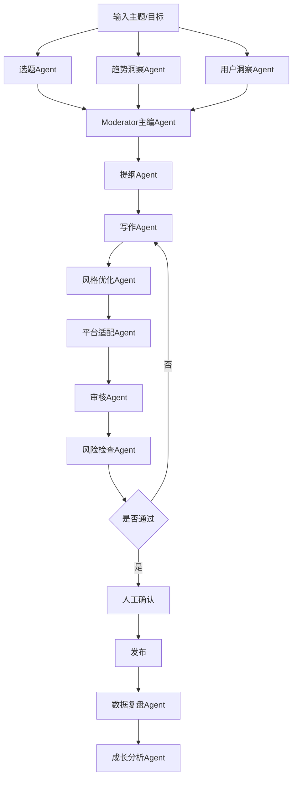
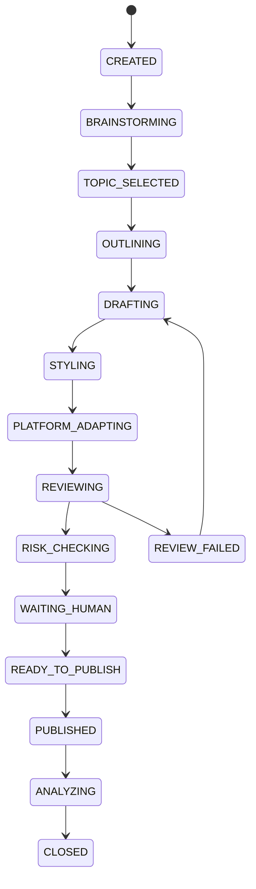

# AI 多 Agent 协作平台 PRD（自媒体场景专项）

作者：jerry.guo
版本：v1.0
日期：2026-04-02
文档状态：自媒体场景专项 PRD
适用对象：创业者 / 产品经理 / 架构师 / 内容运营 / 编辑 / 研发团队

---

# 1. 文档目的

本文档用于定义 **AI 多 Agent 协作平台在自媒体内容生产场景中的专项需求**。

本专项 PRD 的目标不是描述一个抽象的 AI 平台，而是明确回答下面这些实际问题：

1. 一个自媒体团队日常是如何工作的
2. 哪些内容生产环节可以交给多 Agent 完成
3. 哪些环节必须有人参与
4. 多 Agent 在内容场景里应该怎么协作
5. 如何让每个 Agent 逐渐形成“专业分工”
6. 如何用数据和反馈让内容团队越来越强
7. 平台产品上应该有哪些页面、功能和流程来支持这一整套业务

---

# 2. 项目背景

现在很多自媒体创业者和内容团队都在使用 AI，但常见问题非常明显：

* 只能临时写 prompt，无法形成稳定流程
* 选题不稳定，容易靠感觉
* 内容质量时好时坏
* 不同平台内容适配很费时间
* 审核过程混乱，容易漏掉风险
* 发布后没有系统复盘
* AI 不知道自己以前写过什么、什么内容表现好、什么写法容易失败

所以，虽然 AI 已经能“帮忙写”，但距离真正变成一个 **可协作、可成长、可交付的内容团队**，还差很远。

我们希望通过这个平台，把内容生产流程从：

> “一次次对话式生成”

升级成：

> “像公司团队一样稳定协作的内容生产系统”

---

# 3. 项目目标

本项目在自媒体场景中的核心目标是：

## 3.1 业务目标

帮助内容团队实现以下能力：

1. 稳定生成选题
2. 稳定生成不同平台内容
3. 控制内容质量和风险
4. 提升发布效率
5. 建立发布后的数据复盘闭环
6. 让每个 Agent 都形成长期专业能力
7. 让整个内容团队具备持续优化能力

---

## 3.2 平台目标

平台需要支持用户完成以下事情：

```text
设计内容团队 → 配置角色分工 → 配置协作流程 → 执行内容任务 → 人工审核 → 发布 → 复盘 → 优化团队
```

---

## 3.3 成功标准

产品上线后，希望达到以下结果：

* 自媒体团队可以通过平台完成日常内容生产
* 从“选题到成稿”的时间显著缩短
* 内容的一次审核通过率提高
* 内容风格稳定性提升
* 发布后可以清楚知道哪些内容成功、为什么成功
* 团队知道哪些 Agent 擅长什么，哪些地方还需优化

---

# 4. 适用用户

---

## 4.1 内容创业者 / 个人 IP 主理人

特点：

* 一个人或小团队做内容
* 希望把 AI 当“内容团队”
* 重视效率、风格统一、个人表达

核心诉求：

* 我想更快产出内容
* 我希望内容有自己的风格，不是很 AI
* 我需要 AI 帮我分担选题、写作、改写、复盘等工作
* 我还需要保留关键内容的人工把关权

---

## 4.2 内容运营团队

特点：

* 通常负责多个账号或多个平台
* 关注产能、节奏、风险、效果

核心诉求：

* 如何批量管理内容生产
* 如何让不同内容 Agent 分工明确
* 如何快速知道哪些内容需要人工处理
* 如何让团队形成 SOP

---

## 4.3 编辑 / 审核人员

特点：

* 关注质量与发布前把关
* 通常不关心底层模型和架构

核心诉求：

* 我只想看到最终候选稿件和关键过程
* 我需要方便地修改、驳回和给意见
* 我希望 AI 能学会我平时的修改习惯

---

## 4.4 产品经理 / 架构师 / 技术负责人

特点：

* 需要把内容业务抽象成平台能力
* 需要支持长期可维护、可扩展的系统

核心诉求：

* 业务流程怎么拆模块
* 哪些 Agent 必须支持
* 哪些流程适合串行，哪些适合并行
* 状态机、审批、复盘、成长怎么做

---

# 5. 业务场景定义

---

# 5.1 核心业务场景

本专项主要面向以下内容生产场景：

1. 选题策划
2. 图文内容生成
3. 视频脚本生成
4. 平台改写与适配
5. 内容审核与风格校正
6. 发布前人工确认
7. 发布后复盘与成长

---

# 5.2 目标平台

初期重点支持以下平台内容形态：

* X / Twitter 风格短帖
* 小红书图文文案
* 公众号 / 长文
* YouTube / 视频脚本
* 短视频口播脚本

---

# 5.3 一条内容的标准业务链路

平台需要支持一条内容从想法到发布再到复盘的完整流程：

```text
选题发现 → 选题评估 → 方向确认 → 提纲 → 初稿 → 风格优化 → 平台适配 → 审核 → 人工确认 → 发布 → 数据复盘 → 经验沉淀
```

---

# 6. 核心设计理念

---

## 6.1 不是“让 AI 写一篇文章”，而是“让 AI 团队协作生产内容”

平台不把 AI 看成一个万能写手，而是拆成多个明确角色，例如：

* 选题 Agent
* 趋势 Agent
* 用户洞察 Agent
* 写作 Agent
* 风格优化 Agent
* 审核 Agent
* 发布建议 Agent
* 数据复盘 Agent

---

## 6.2 不同阶段使用不同协作模式

不是所有内容任务都应该使用同一种流程。

### 发散探索阶段

适合：

* 并行
* brainstorm
* 多 Agent 讨论

### 正式生产阶段

适合：

* 串行 workflow
* 严格输入输出

### 审核决策阶段

适合：

* review / judge
* human-in-the-loop

### 复盘阶段

适合：

* 并行分析
* 画像更新
* 成长建议

---

## 6.3 人工只参与关键节点

平台并不是追求“100% 自动”。
而是要做到：

* 低价值重复工作交给 AI
* 高价值决策由人控制

典型人工节点：

* 最终选题确认
* 发布前审核
* 高风险内容确认
* 重大方向调整

---

## 6.4 每个 Agent 都应有“岗位感”和“成长感”

每个 Agent 应该像团队中的一个成员：

* 知道自己负责什么
* 知道自己不负责什么
* 知道自己过去做过什么
* 知道自己哪里经常被打回
* 知道哪些写法效果更好

---

# 7. 自媒体团队中的 Agent 角色设计

这一章是专项 PRD 的核心。

---

# 7.1 角色清单总览

建议平台在自媒体场景中支持以下标准 Agent：

1. 选题 Agent
2. 趋势洞察 Agent
3. 用户洞察 Agent
4. Moderator / 主编 Agent
5. 提纲 Agent
6. 写作 Agent
7. 风格优化 Agent
8. 平台适配 Agent
9. 审核 Agent
10. 风险检查 Agent
11. 发布建议 Agent
12. 数据复盘 Agent
13. 成长分析 Agent

初期不一定全部上线，但平台设计上应支持。

---

# 7.2 各 Agent 详细定义

---

## 7.2.1 选题 Agent

### 角色定位

负责提出内容候选方向。

### 主要职责

* 根据主题、账号定位、历史内容提出候选选题
* 给出多个可选方向
* 给出每个方向的简要价值说明

### 不负责内容

* 不负责写正文
* 不负责最终定稿
* 不负责发布审核

### 输入

* 内容方向
* 账号定位
* 近期热点
* 历史内容

### 输出

* 候选选题列表
* 每个选题的亮点说明
* 推荐优先级

### 典型输出示例

```markdown
候选选题：
1. Vibe Coding 到底改变了什么
2. AI 内容团队如何搭建
3. 一个人如何用 AI 做内容创业
```

---

## 7.2.2 趋势洞察 Agent

### 角色定位

负责找外部热点、趋势和潜在爆点。

### 主要职责

* 分析当前热门话题
* 判断哪些话题与账号定位相关
* 给出“为什么值得做”的依据

### 输出

* 热点方向
* 热度说明
* 推荐结合方式

---

## 7.2.3 用户洞察 Agent

### 角色定位

负责补充“用户真正关心什么”。

### 主要职责

* 判断目标用户关心的痛点
* 分析选题是否有传播价值
* 给出用户视角的问题点

### 输出

* 用户关注点
* 用户痛点
* 建议内容切入口

---

## 7.2.4 Moderator / 主编 Agent

### 角色定位

负责从多个候选中收敛方向，像“主编”一样做决策建议。

### 主要职责

* 汇总多个前置 Agent 的结论
* 选择最优选题方向
* 给出选题理由
* 形成内容任务简报

### 输出

* 最终选题建议
* 任务摘要
* 推荐表达方向

### 说明

这个 Agent 很重要，它相当于：

> 在“大家出主意”之后，做出收敛和拍板建议。

---

## 7.2.5 提纲 Agent

### 角色定位

负责把选题变成结构化提纲。

### 主要职责

* 拆解文章结构
* 设计开头、主体、结尾
* 给出章节逻辑

### 输出

* 标题候选
* 内容提纲
* 关键信息点

---

## 7.2.6 写作 Agent

### 角色定位

负责把提纲变成正文初稿。

### 主要职责

* 生成完整初稿
* 保证逻辑完整
* 保证信息表达清楚

### 不负责内容

* 不负责最终风格拟合
* 不负责最终审核和发布

### 输出

* 内容初稿
* 标题候选
* CTA 建议

---

## 7.2.7 风格优化 Agent

### 角色定位

负责把内容改得更像“这个账号本人写的”。

### 主要职责

* 调整语气
* 调整句式
* 增强口语感
* 降低 AI 味
* 保持品牌 / 人设风格

### 输出

* 风格优化后的内容
* 风格调整说明

---

## 7.2.8 平台适配 Agent

### 角色定位

负责将同一主题内容改写为不同平台版本。

### 主要职责

* 转成 X 风格短帖
* 转成小红书风格文案
* 转成视频口播脚本
* 转成长文版

### 输出

* 不同平台版本内容

---

## 7.2.9 审核 Agent

### 角色定位

负责检查内容质量。

### 主要职责

* 检查逻辑是否清晰
* 检查结构是否完整
* 检查表达是否啰嗦
* 检查是否偏离主题
* 检查是否像 AI 套话

### 输出

* 是否通过
* 问题清单
* 修改建议

---

## 7.2.10 风险检查 Agent

### 角色定位

负责检查平台规则、违规风险和敏感表达。

### 主要职责

* 识别潜在违规
* 识别高风险表述
* 识别可能引发误解的表述

### 输出

* 风险等级
* 风险原因
* 修改建议

---

## 7.2.11 发布建议 Agent

### 角色定位

负责补充发布层面的建议。

### 主要职责

* 给出发布时间建议
* 给出标签建议
* 给出封面文案建议
* 给出配图建议

---

## 7.2.12 数据复盘 Agent

### 角色定位

负责发布后复盘内容效果。

### 主要职责

* 分析点击、点赞、评论、完播等数据
* 判断内容为什么表现好/差
* 指出问题出在选题、开头、结构还是风格

### 输出

* 复盘报告
* 成功原因
* 失败原因
* 优化建议

---

## 7.2.13 成长分析 Agent

### 角色定位

负责总结整个内容团队的表现变化。

### 主要职责

* 统计哪些 Agent 越来越强
* 统计哪些环节最容易卡住
* 给出团队级优化建议

---

# 8. 典型协作模式设计

---

# 8.1 模式一：选题阶段（并行 brainstorm）

适用于：

* 方向不明确
* 需要多角度探索
* 需要找到更有传播力的切入口

参与 Agent：

* 选题 Agent
* 趋势洞察 Agent
* 用户洞察 Agent

执行方式：

* 并行输出各自观点
* Moderator Agent 汇总

结果：

* 形成选题建议

---

# 8.2 模式二：内容生产阶段（串行 workflow）

适用于：

* 任务已经明确
* 需要稳定产出
* 每一步依赖上一步

参与 Agent：

* 提纲 Agent
* 写作 Agent
* 风格优化 Agent
* 平台适配 Agent

执行方式：

```text
提纲 → 初稿 → 风格优化 → 平台适配
```

---

# 8.3 模式三：审核与发布阶段（review + human）

适用于：

* 高风险内容
* 对外发布内容
* 需要人工保底

参与 Agent：

* 审核 Agent
* 风险检查 Agent
* 人工编辑 / 主理人

执行方式：

```text
审核Agent → 风险Agent → 人工确认
```

---

# 8.4 模式四：复盘阶段（并行分析）

适用于：

* 发布后分析
* 团队成长
* 形成反馈闭环

参与 Agent：

* 数据复盘 Agent
* 成长分析 Agent

执行方式：

* 读取内容表现数据
* 输出复盘与优化建议
* 更新 Agent 画像

---

# 9. 自媒体内容生产全流程

---

## 9.1 标准流程

平台在自媒体场景中，至少应支持如下标准链路：



---

## 9.2 流程分阶段解释

### 第一阶段：方向探索

目标是找到值得做的内容。

### 第二阶段：内容产出

目标是形成结构完整、风格稳定的内容。

### 第三阶段：审核与发布

目标是保证质量和风险可控。

### 第四阶段：复盘成长

目标是让系统越来越会做内容。

---

# 10. 核心功能需求

下面开始讲平台具体要做什么功能。

---

# 10.1 内容 Team 模板管理

## 10.1.1 功能目标

让用户快速使用“内容团队模板”，而不是从零配置所有 Agent。

## 10.1.2 功能说明

平台应支持预置 Team 模板，例如：

* 爆款短帖团队
* 小红书图文团队
* 视频脚本团队
* 长文写作团队
* 个人 IP 内容团队

用户可以：

* 一键创建模板
* 在模板基础上增删 Agent
* 调整角色顺序和协作模式

---

# 10.2 Agent 设计台（内容场景专项）

## 10.2.1 功能目标

让用户可以像配置“内容岗位”一样配置 Agent。

## 10.2.2 页面能力

每个 Agent 页面应至少支持：

### 基本信息

* 名称
* 描述
* 场景类型
* 所属 Team

### 职责定义

* 负责什么
* 不负责什么
* 输出目标是什么

### Prompt 配置

* system prompt
* role prompt
* task template
* constraint
* output schema
* few-shot

### 风格配置

* 是否偏口语
* 是否偏短句
* 是否偏情绪
* 是否偏专业
* 是否使用固定表达方式

### 知识绑定

* 账号风格手册
* 历史高表现内容
* 平台规则
* 品牌词库

### 工具配置

* 热点检索
* 数据查询
* 内容模板
* 标题生成器
* 平台规则库

### 成长画像

* 历史任务数
* 一次通过率
* 常见被打回问题
* 最近优化建议

---

# 10.3 内容 Workflow 设计台

## 10.3.1 功能目标

让用户按内容业务方式设计内容生产流程。

## 10.3.2 支持节点类型

* 开始节点
* brainstorm 节点
* moderator 节点
* 写作节点
* 风格优化节点
* 平台适配节点
* 审核节点
* 风险节点
* 人工审批节点
* 发布节点
* 复盘节点
* 结束节点

---

## 10.3.3 支持的规则能力

* 审核不通过退回写作
* 风险命中时必须人工审批
* 某平台版本质量差时只重跑平台适配
* 选题阶段允许多个 Agent 并行讨论
* 发布前必须经过人工确认

---

# 10.4 内容任务中心

## 10.4.1 功能目标

让用户看到所有内容任务的执行情况。

## 10.4.2 页面信息

每个任务应看到：

* 任务标题
* 所属 Team
* 所属平台
* 当前状态
* 当前节点
* 创建时间
* 是否待人工处理
* 是否失败
* 最终输出内容

## 10.4.3 操作能力

* 查看任务详情
* 查看步骤执行结果
* 重试失败节点
* 回退到某一步
* 手动改稿
* 取消任务

---

# 10.5 审核中心

## 10.5.1 功能目标

给编辑或主理人一个统一的“待处理池”。

## 10.5.2 页面能力

应支持：

* 查看待审核内容
* 查看 AI 审核意见
* 查看风险检查结果
* 查看历史修改版本
* 查看最终候选稿件

## 10.5.3 审批动作

* 通过
* 驳回
* 修改后通过
* 回退到写作
* 回退到风格优化
* 取消发布

---

# 10.6 记忆中心（内容场景）

## 10.6.1 功能目标

让平台记住“这个账号怎么写、什么内容好、什么内容不要再犯”。

## 10.6.2 记忆分类

### 账号风格记忆

例如：

* 常用表达方式
* 常用句式节奏
* 个人语气
* 是否喜欢提问式开头
* 是否偏理性/偏情绪

### 历史成功案例记忆

例如：

* 爆款标题样本
* 高互动内容样本
* 高完播视频脚本样本

### 历史失败案例记忆

例如：

* 被批“太 AI”
* 开头没有吸引力
* 太长、太平
* 平台适配失败

### Agent 个人记忆

例如：

* 写作 Agent 最近常见问题
* 风格 Agent 最近最成功的调优方法
* 审核 Agent 最近识别出的高频问题

---

# 10.7 复盘与成长中心

## 10.7.1 功能目标

把“发布结果”真正沉淀成团队经验。

## 10.7.2 数据输入

可以接入：

* 点击率
* 点赞
* 评论
* 收藏
* 转发
* 完播率
* 阅读时长
* 转化数据

## 10.7.3 输出内容

系统应能输出：

* 哪类选题表现最好
* 哪种开头最容易吸引人
* 哪个平台版本最弱
* 哪个 Agent 经常导致返工
* 哪个 Agent 越来越稳定
* 当前团队的主要瓶颈是什么

---

# 11. Human-in-the-loop 设计

---

# 11.1 为什么内容场景必须有人在环中

因为内容生产有两个特点：

1. 主观性很强
2. 对外发布风险高

所以不适合完全自动化。

---

# 11.2 人工介入的推荐节点

### 节点一：选题确认

AI 给多个方向，人来拍板。

### 节点二：发布前确认

AI 内容通过审核后，人做最终决定。

### 节点三：重大异常处理

例如连续多篇低表现、审核反复失败、风格明显跑偏。

---

# 11.3 人工反馈沉淀要求

人工每次修改或驳回，都要记录：

* 修改前内容
* 修改后内容
* 修改原因
* 归类标签

这些数据将用于：

* 优化 Agent Prompt
* 优化风格记忆
* 优化审核规则
* 沉淀为成长样本

---

# 12. 内容专项状态机设计

---

# 12.1 内容任务总体状态

建议内容任务至少支持以下状态：

* CREATED
* BRAINSTORMING
* TOPIC_SELECTED
* OUTLINING
* DRAFTING
* STYLING
* PLATFORM_ADAPTING
* REVIEWING
* RISK_CHECKING
* WAITING_HUMAN
* READY_TO_PUBLISH
* PUBLISHED
* REVIEW_FAILED
* FAILED
* CANCELED
* ANALYZING
* CLOSED

---

# 12.2 典型流转



---

# 13. 详细用户故事

---

## 13.1 作为个人 IP 主理人

我希望输入一个主题，就能让多个 Agent 帮我找方向、生成内容、做风格优化和审核，这样我只在关键节点拍板，不用从头自己写。

---

## 13.2 作为内容编辑

我希望在审核中心看到 AI 已经做过哪些工作、当前稿件有哪些问题，这样我能高效做判断，而不是重新从头看。

---

## 13.3 作为内容运营

我希望知道最近哪些内容方向表现最好、哪些环节返工最多，这样我能优化团队协作方式。

---

## 13.4 作为产品经理

我希望为不同内容场景设计不同 Team 和 Workflow，例如短帖团队和视频脚本团队使用不同流程。

---

## 13.5 作为架构师

我希望明确内容场景中有哪些核心对象和状态流，这样我可以设计稳定的任务执行系统。

---

# 14. 页面设计建议

---

# 14.1 内容工作台

展示内容：

* 今日待处理任务
* 待审核任务
* 今日已发布内容
* 最近表现最好内容
* 失败最多环节
* 团队健康度

---

# 14.2 内容 Team 页面

展示内容：

* Team 名称
* 使用场景
* 团队成员 Agent
* 当前流程模板
* 近期产出表现

---

# 14.3 Agent 详情页

展示内容：

* Agent 职责
* Prompt 配置
* 风格配置
* 工具绑定
* 成长画像
* 最近任务表现
* 常见被退回原因

---

# 14.4 内容流程设计页

展示内容：

* 节点流程图
* 节点配置
* 回退规则
* 审批节点
* 发布节点
* 复盘节点

---

# 14.5 内容任务详情页

展示内容：

* 原始任务目标
* 各步骤输出结果
* 当前稿件版本
* AI 审核意见
* 风险检查意见
* 人工修改记录
* 发布结果
* 复盘结果

---

# 14.6 审核中心

展示内容：

* 待审核清单
* 平台类型
* 内容类型
* 风险等级
* 修改建议
* 审批入口

---

# 14.7 复盘中心

展示内容：

* 内容表现排行
* 选题表现排行
* 标题表现排行
* 开头表现分析
* 平台适配问题
* Agent 表现趋势

---

# 15. 非功能需求

---

## 15.1 稳定性

平台在内容场景下必须支持：

* 节点失败重试
* 回退重跑
* 审核失败回退
* 内容版本保存
* 人工接管

---

## 15.2 可追踪性

必须能看到：

* 内容是怎么一步步生成的
* 哪个 Agent 负责了什么
* 哪里被修改了
* 为什么被打回
* 哪个版本最终被发布

---

## 15.3 风格一致性

平台必须支持：

* 风格规范注入
* 账号历史成功样本注入
* 人工修改沉淀为风格记忆

---

## 15.4 可扩展性

初期先支持图文和脚本，后续应支持：

* 配图建议
* 多语言内容
* 多账号矩阵
* 自动排期
* 自动发布接口

---

# 16. MVP 范围建议

如果先做 MVP，建议聚焦一个最小闭环，不要一次做太多。

---

## 16.1 MVP 推荐场景

先做：

> **X / 小红书图文内容团队**

---

## 16.2 MVP 必备 Agent

建议先做这 6 个：

1. 选题 Agent
2. Moderator Agent
3. 写作 Agent
4. 风格优化 Agent
5. 审核 Agent
6. 数据复盘 Agent

---

## 16.3 MVP 必备流程

```text
选题 brainstorm → 选题确定 → 写作 → 风格优化 → 审核 → 人工确认 → 发布 → 复盘
```

---

## 16.4 MVP 必备页面

* 内容 Team 页面
* Agent 页面
* 内容流程设计页
* 任务中心
* 审核中心
* 复盘中心

---

# 17. 验收标准

---

## 17.1 Team 能力

* 可以创建一个内容 Team
* 可以为 Team 绑定多个 Agent
* 可以定义 Team 的默认流程

---

## 17.2 Agent 能力

* 可以配置角色、Prompt、风格、知识和工具
* 可以查看 Agent 的历史表现和成长画像

---

## 17.3 流程能力

* 可以支持 brainstorm + moderator + 串行生产 + 审核 + 人工确认
* 可以支持审核不通过回退

---

## 17.4 任务能力

* 可以创建内容任务
* 可以查看任务每一步执行情况
* 可以查看最终内容
* 可以手动修改和重试

---

## 17.5 复盘能力

* 可以记录发布后的表现数据
* 可以输出复盘结果
* 可以更新 Agent 的成长画像

---

# 18. 风险与难点

---

## 18.1 风格学习难

如果没有足够历史样本，风格优化可能效果一般。
所以产品上必须支持人工修改沉淀。

---

## 18.2 选题质量高度依赖外部信息

选题 Agent 需要热点和趋势支持，否则容易空转。

---

## 18.3 审核逻辑可能过松或过严

需要允许人工不断调整审核规则和经验库。

---

## 18.4 复盘容易流于表面

必须把“内容表现数据”真正和 Agent 成长连接起来，而不是只出一份复盘报告。

---

# 19. 总结

这个专项 PRD 的核心，是把“AI 写内容”升级成“AI 内容团队协作”。

一句话总结：

> **平台不是替你临时写一篇稿子，而是帮你搭建一个能持续产出、可控、可复盘、可成长的内容团队。**

再具体一点，就是：

* 用多个 Agent 分工代替一个万能 AI
* 用不同协作模式适配不同内容阶段
* 用人工审批保证质量和风险
* 用复盘和画像让每个 Agent 越来越专业
* 用平台把内容生产从“凭感觉”变成“有流程、有记忆、有成长的系统”

