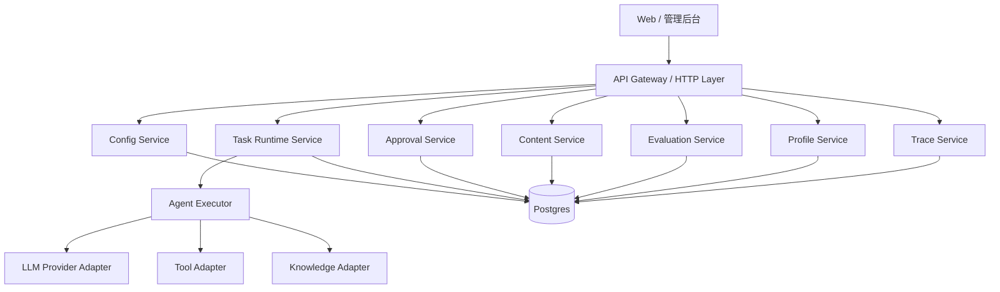
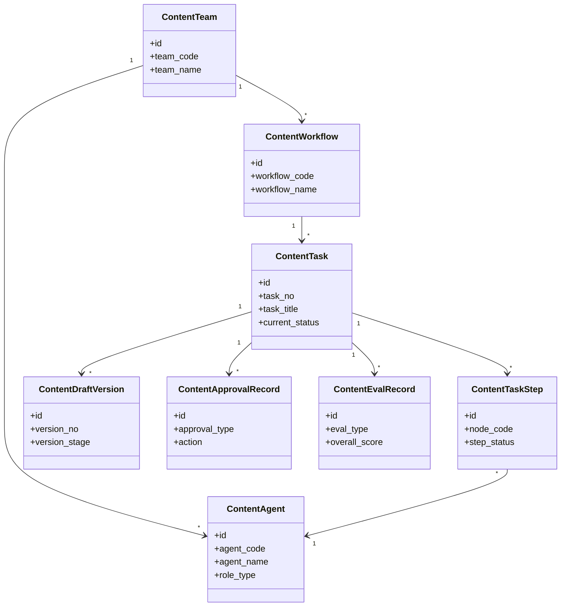
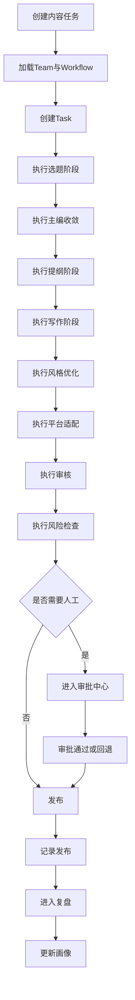
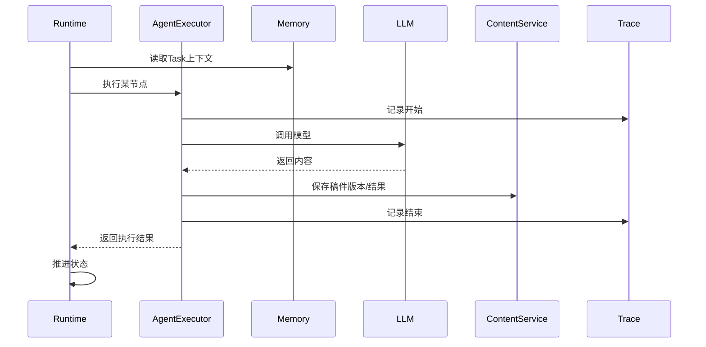
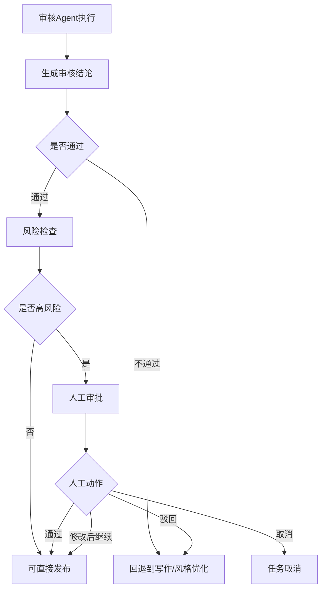

# 自媒体多 Agent 协作平台技术方案设计（Rust 版）

作者：jerry.guo
版本：v1.0
日期：2026-04-03
文档状态：详细方案设计
适用对象：架构师 / Rust 后端开发 / 前端开发 / 测试 / 项目经理

---

# 1. 文档目标

本文档用于指导研发团队基于 PRD 实现一套 **自媒体多 Agent 协作平台**。

这份文档希望解决三个问题：

1. **系统应该怎么拆**
2. **核心流程应该怎么跑**
3. **开发团队应该先做什么、后做什么**

本文档尽量避免过于学术化或过于抽象的表达，重点是让开发同学能快速理解：

* 为什么这样设计
* 每个模块做什么
* 模块之间怎么配合
* 代码层面应该怎么组织
* 接口层面应该怎么设计
* 项目层面怎么拆任务推进

---

# 2. 系统建设目标

这套系统不是一个简单的“AI 写作页面”，而是一个 **内容生产操作系统**。

它要完成的是一条完整链路：

```text
团队配置 → Agent 配置 → 流程配置 → 内容任务执行 → 审核 → 发布 → 复盘 → 成长
```

系统要支持以下核心能力：

1. 支持多个 Agent 分工协作
2. 支持流程化内容生产
3. 支持人工审批和人工修改
4. 支持稿件版本管理
5. 支持任务全链路可追踪
6. 支持发布后复盘
7. 支持 Agent 和 Team 的成长分析

---

# 3. 系统范围

## 3.1 本期包含

本期系统重点支持以下范围：

* 内容 Team 管理
* 内容 Agent 管理
* Workflow 流程设计
* 内容任务执行
* 内容稿件版本管理
* 审核与人工介入
* 发布记录管理
* 内容复盘与评估
* Agent/Team 画像与优化建议
* Trace / LLM 调用日志

## 3.2 本期不包含

以下内容暂不作为第一版重点：

* 自动发内容到所有外部平台
* 真正的素材生成（图片、视频自动生成）
* 复杂多租户隔离
* 自动模型训练
* 完整 BI 平台
* 极复杂权限系统

---

# 4. 设计原则

---

## 4.1 配置和运行分离

系统中存在两类数据：

### 配置类

例如：

* Team
* Agent
* Agent Version
* Workflow
* Workflow Version

特点：

* 改动频率低
* 需要版本控制
* 需要审核和发布

### 运行类

例如：

* Task
* TaskStep
* DraftVersion
* ApprovalRecord
* TraceLog

特点：

* 写入频繁
* 必须可追踪
* 必须可恢复

所以系统设计上必须明确分开：

```text
配置中心
和
运行中心
```

---

## 4.2 流程驱动，而不是页面驱动

很多系统一开始从页面出发，结果最后变成“页面逻辑到处写”。
这套系统应该从 **流程引擎 + 状态机** 出发。

也就是说：

* 页面只是操作入口
* 真正核心是 Runtime
* Runtime 决定任务怎么走
* 页面只是显示当前状态

---

## 4.3 Agent 是角色，不是大 Prompt

每个 Agent 都应该是一个“岗位对象”，而不是只保存一段 prompt。

它至少要包含：

* 角色定义
* 职责边界
* 输入定义
* 输出定义
* Prompt 配置
* 策略配置
* 风格配置
* 工具绑定
* 知识绑定
* 版本信息

---

## 4.4 先保证可跑通，再做智能优化

第一版最重要的是：

* 一条任务可以完整跑通
* 中间失败能定位
* 人工可以接管
* 数据可以沉淀

而不是一开始就追求“自动优化全部 Agent”。

---

## 4.5 所有关键动作都要可追踪

必须能回答这些问题：

* 任务卡在哪里了
* 哪个 Agent 生成了当前稿件
* 为什么审核没过
* 哪次人工修改了什么
* 哪个版本被最终发布
* 发布后表现如何
* 为什么系统建议优化某个 Agent

---

# 5. 业务理解：用一句话讲清系统在做什么

这套系统可以理解成：

> **一个由多个数字员工组成的内容团队管理系统**

其中：

* Team = 团队
* Agent = 岗位员工
* Workflow = 工作流
* Task = 一次内容任务
* DraftVersion = 每轮稿件版本
* Approval = 主编/编辑审批
* Eval = 内容质量评分
* Profile = 员工画像 / 团队画像

---

# 6. 总体架构设计

---

# 6.1 总体架构图



---

# 6.2 模块说明

## 6.2.1 API Layer

负责：

* 接收前端请求
* 参数校验
* 鉴权
* 路由到内部服务

不负责：

* 核心业务编排
* 任务状态推进

---

## 6.2.2 Config Service

负责：

* Team 管理
* Agent 管理
* Workflow 管理
* 版本发布

---

## 6.2.3 Task Runtime Service

这是系统核心。

负责：

* 创建任务
* 生成步骤
* 按流程执行
* 推进状态
* 处理重试
* 处理回退
* 处理人工等待

---

## 6.2.4 Agent Executor

负责单个 Agent 的实际执行：

* 组装上下文
* 注入 Prompt
* 注入 Memory
* 调用 LLM
* 调用工具
* 返回结果

---

## 6.2.5 Content Service

负责：

* 稿件版本保存
* 平台素材保存
* 发布记录保存

---

## 6.2.6 Approval Service

负责：

* 生成审批单
* 查询待审批任务
* 审批动作处理
* 审批后推进任务

---

## 6.2.7 Evaluation Service

负责：

* 内容质量评估
* 维度评分
* 发布后效果评估
* 复盘结论生成

---

## 6.2.8 Profile Service

负责：

* Agent 画像更新
* Team 画像更新
* 优化建议生成

---

## 6.2.9 Trace Service

负责：

* 记录运行轨迹
* 记录 LLM 调用日志
* 提供 replay 需要的数据基础

---

# 7. Rust 技术栈建议

下面给一套适合 Rust 的相对稳妥方案。

## 7.1 Web 框架

建议：

* **Axum**

原因：

* 生态成熟
* 与 Tower 配合好
* 结构清晰
* 比较适合中后台服务

---

## 7.2 数据库访问

建议二选一：

### 方案 A：SQLx

优点：

* 编译期 SQL 校验
* 性能稳
* 适合你们这种强 SQL 控制型系统

### 方案 B：SeaORM

优点：

* ORM 更完整
* 对初期开发同学更友好

### 推荐结论

**核心运行链路优先 SQLx**
因为：

* 状态机和流程查询会比较复杂
* 任务系统通常需要对 SQL 有较强控制力

---

## 7.3 异步运行时

* **Tokio**

---

## 7.4 序列化

* **Serde**
* `serde_json`

---

## 7.5 配置管理

* `config`
* `dotenvy`

---

## 7.6 日志与追踪

* `tracing`
* `tracing-subscriber`

---

## 7.7 错误处理

* `thiserror`
* `anyhow`（在应用层）
* 核心领域建议定义自己的错误类型

---

## 7.8 HTTP Client

* `reqwest`

---

## 7.9 工作流表达

第一版建议：

* Workflow 配置保存在数据库
* Runtime 在 Rust 中自己解释执行
* 暂时不要上很重的外部工作流引擎

---

# 8. Rust 工程结构建议

建议采用 **分层 + 模块化** 的结构，不要一开始做成过度微服务。

第一版推荐 **单体模块化架构**，后面再拆服务。

---

## 8.1 推荐目录结构

```text
src/
├── main.rs
├── bootstrap/
│   ├── app.rs
│   ├── config.rs
│   ├── router.rs
│   └── state.rs
├── common/
│   ├── error.rs
│   ├── result.rs
│   ├── enums.rs
│   ├── pagination.rs
│   └── utils.rs
├── api/
│   ├── mod.rs
│   ├── team_api.rs
│   ├── agent_api.rs
│   ├── workflow_api.rs
│   ├── task_api.rs
│   ├── approval_api.rs
│   ├── evaluation_api.rs
│   └── profile_api.rs
├── application/
│   ├── mod.rs
│   ├── team_service.rs
│   ├── agent_service.rs
│   ├── workflow_service.rs
│   ├── task_runtime_service.rs
│   ├── agent_executor_service.rs
│   ├── approval_service.rs
│   ├── content_service.rs
│   ├── evaluation_service.rs
│   ├── profile_service.rs
│   └── trace_service.rs
├── domain/
│   ├── mod.rs
│   ├── team.rs
│   ├── agent.rs
│   ├── workflow.rs
│   ├── task.rs
│   ├── draft.rs
│   ├── approval.rs
│   ├── evaluation.rs
│   ├── profile.rs
│   └── state_machine.rs
├── infrastructure/
│   ├── mod.rs
│   ├── db/
│   │   ├── mod.rs
│   │   ├── postgres.rs
│   │   ├── repositories/
│   │   │   ├── team_repo.rs
│   │   │   ├── agent_repo.rs
│   │   │   ├── workflow_repo.rs
│   │   │   ├── task_repo.rs
│   │   │   ├── content_repo.rs
│   │   │   ├── approval_repo.rs
│   │   │   ├── evaluation_repo.rs
│   │   │   └── profile_repo.rs
│   ├── llm/
│   │   ├── mod.rs
│   │   ├── provider.rs
│   │   ├── openai.rs
│   │   ├── anthropic.rs
│   │   └── gemini.rs
│   ├── tools/
│   │   ├── mod.rs
│   │   └── tool_registry.rs
│   └── knowledge/
│       ├── mod.rs
│       └── knowledge_client.rs
└── jobs/
    ├── mod.rs
    ├── profile_job.rs
    ├── evaluation_job.rs
    └── metric_sync_job.rs
```

---

# 9. 概念模型说明

---

# 9.1 核心概念之间的关系



---

# 9.2 关键对象解释

## Team

代表一支内容团队。
例如：

* 小红书内容团队
* X 短帖团队

## Agent

代表一个角色。
例如：

* 选题 Agent
* 主编 Agent
* 写作 Agent
* 审核 Agent

## Workflow

代表一套可执行流程。
例如：

* 选题 brainstorm → 写作 → 风格优化 → 审核 → 人工确认 → 发布

## Task

代表一次内容任务。
例如：

* “做一篇关于 AI Harness 的小红书图文”

## TaskStep

代表任务中的某一步。
例如：

* 写作节点
* 风格优化节点
* 审核节点

## DraftVersion

代表某一步产生的一版稿件。

## ApprovalRecord

代表一次人工审批或人工处理动作。

## EvalRecord

代表一次评分或复盘结果。

---

# 10. 核心业务流程设计

---

# 10.1 内容任务主流程

这是最核心流程。



---

# 10.2 任务创建流程

## 流程说明

当用户创建一条内容任务时，系统需要：

1. 接收基础输入
2. 确定使用哪个 Team
3. 确定使用哪个 Workflow 版本
4. 创建 Task
5. 初始化 TaskStep
6. 推动流程启动

## 关键规则

* Task 一旦创建，就要绑定：

  * `team_id`
  * `workflow_id`
  * `workflow_version_no`
* 不允许后续随意切换流程版本
* 所有步骤实例化时，要绑定 Agent 版本

---

# 10.3 单步骤执行流程

每个步骤执行都应该遵循统一流程。



---

## 执行步骤细化

每个 Agent 节点执行建议分 8 步：

1. 读取节点配置
2. 读取 Agent 配置与版本
3. 读取 Task Memory
4. 读取最近稿件版本
5. 组装 Prompt / 输入上下文
6. 执行 LLM / Tool
7. 保存输出
8. 返回执行结果和状态

---

# 10.4 审核与人工回退流程

审核是内容场景最重要的控制点。



---

# 10.5 复盘流程

发布之后，不是结束，而是进入复盘。

## 流程

1. 从发布记录读取内容
2. 从指标表读取表现数据
3. 生成内容评估
4. 更新 Agent Profile
5. 更新 Team Profile
6. 生成优化建议

---

# 11. 状态机设计

---

# 11.1 任务状态机

建议直接沿用 PRD 中的状态设计。

## Task 状态

* CREATED
* BRAINSTORMING
* TOPIC_SELECTED
* OUTLINING
* DRAFTING
* STYLING
* PLATFORM_ADAPTING
* REVIEWING
* RISK_CHECKING
* WAITING_HUMAN
* READY_TO_PUBLISH
* PUBLISHED
* REVIEW_FAILED
* FAILED
* CANCELED
* ANALYZING
* CLOSED

---

## 状态推进原则

* 状态推进必须由 Runtime Service 统一处理
* 业务代码不要在不同地方直接改 Task 状态
* 所有状态变更都记录 Trace

---

# 11.2 步骤状态机

## Step 状态

* PENDING
* READY
* RUNNING
* SUCCESS
* FAILED
* RETRYING
* WAITING_HUMAN
* SKIPPED
* CANCELED

---

## 关键规则

* Step 状态决定 Task 是否可推进
* 关键节点失败时，Task 不能直接进入 DONE
* 并行节点时，必须等聚合规则满足才推进

---

# 12. 模块详细设计

---

# 12.1 Team 模块

## 职责

负责管理内容团队。

## 核心能力

* 创建 Team
* 查询 Team
* 编辑 Team
* 绑定 Agent
* 设置默认 Workflow

## 核心接口

* `POST /api/teams`
* `GET /api/teams`
* `GET /api/teams/{id}`
* `PUT /api/teams/{id}`
* `POST /api/teams/{id}/agents`
* `PUT /api/teams/{id}/default-workflow`

---

# 12.2 Agent 模块

## 职责

负责管理 Agent 及其版本。

## 核心能力

* 创建 Agent
* 发布 Agent 版本
* 查询 Agent 详情
* 查询 Agent 画像

## 核心接口

* `POST /api/agents`
* `GET /api/agents`
* `GET /api/agents/{id}`
* `POST /api/agents/{id}/versions`
* `GET /api/agents/{id}/versions`
* `GET /api/agents/{id}/profile`

---

# 12.3 Workflow 模块

## 职责

负责管理内容流程模板。

## 核心能力

* 创建流程
* 保存流程版本
* 校验流程配置
* 发布流程
* 获取节点与边

## 核心接口

* `POST /api/workflows`
* `GET /api/workflows`
* `GET /api/workflows/{id}`
* `POST /api/workflows/{id}/versions`
* `POST /api/workflows/{id}/validate`
* `POST /api/workflows/{id}/publish`

---

# 12.4 Task Runtime 模块

这是实现复杂度最高的模块。

## 职责

* 创建任务
* 实例化步骤
* 驱动步骤执行
* 推进状态
* 处理失败
* 处理回退
* 处理审批挂起

## 核心接口

* `POST /api/tasks`
* `GET /api/tasks`
* `GET /api/tasks/{id}`
* `POST /api/tasks/{id}/start`
* `POST /api/tasks/{id}/retry`
* `POST /api/tasks/{id}/cancel`
* `POST /api/tasks/{id}/reroute`

---

## Runtime 内部子模块建议

### TaskInitializer

负责任务初始化

### StepPlanner

负责根据 Workflow 生成步骤

### StepDispatcher

负责选择哪个步骤可执行

### StepRunner

负责调用 AgentExecutor

### StateManager

负责状态推进

### RetryHandler

负责失败重试

### HumanWaitHandler

负责人工挂起处理

---

# 12.5 Agent Executor 模块

## 职责

执行单个 Agent 节点。

## 输入

* Task
* Step
* AgentVersion
* Memory
* 上游输出

## 输出

* 执行结果
* 稿件内容
* 结构化结果
* 是否成功
* 是否需要人工

---

## 核心抽象建议

```rust
pub struct AgentExecutionContext {
    pub task_id: i64,
    pub step_id: i64,
    pub agent_id: i64,
    pub agent_version_no: i32,
    pub input_payload: serde_json::Value,
    pub task_memory: serde_json::Value,
    pub latest_draft: Option<String>,
}
```

```rust
pub struct AgentExecutionResult {
    pub success: bool,
    pub output_text: Option<String>,
    pub output_structured: Option<serde_json::Value>,
    pub score: Option<f64>,
    pub need_human: bool,
    pub fail_reason: Option<String>,
}
```

---

# 12.6 Content 模块

## 职责

管理稿件、素材、发布记录。

## 核心能力

* 保存稿件版本
* 查询任务稿件列表
* 标记最终稿
* 保存发布记录
* 保存素材建议

## 核心接口

* `GET /api/tasks/{id}/drafts`
* `POST /api/tasks/{id}/drafts`
* `POST /api/publish-records`
* `GET /api/publish-records/{id}`

---

# 12.7 Approval 模块

## 职责

处理人工审批。

## 核心能力

* 生成待审批单
* 查询待审批列表
* 审批通过
* 驳回并回退
* 修改后继续

## 核心接口

* `GET /api/approvals/pending`
* `GET /api/approvals/{id}`
* `POST /api/approvals/{id}/approve`
* `POST /api/approvals/{id}/reject`
* `POST /api/approvals/{id}/modify-and-continue`
* `POST /api/approvals/{id}/cancel`

---

# 12.8 Evaluation 模块

## 职责

负责评分和复盘。

## 核心能力

* 为内容生成评分
* 记录维度打分
* 生成复盘结论

## 核心接口

* `POST /api/evaluations/run`
* `GET /api/evaluations/{targetType}/{targetId}`
* `GET /api/tasks/{id}/review-summary`

---

# 12.9 Profile 模块

## 职责

更新 Agent 和 Team 画像。

## 核心能力

* 统计 Agent 表现
* 统计 Team 表现
* 生成优化建议

## 核心接口

* `GET /api/agents/{id}/profile`
* `GET /api/teams/{id}/profile`
* `GET /api/optimization-suggestions`

---

# 13. API 设计建议

下面给一套更接近开发可用的接口说明。

---

# 13.1 创建内容任务

## 请求

`POST /api/tasks`

```json
{
  "taskTitle": "AI Harness 的小红书图文",
  "contentTopic": "AI Harness Engineering",
  "targetPlatform": "XHS",
  "contentType": "post",
  "teamId": 1001,
  "workflowId": 2001,
  "inputPayload": {
    "coreIdea": "讲清楚AI Harness是什么",
    "tone": "专业但通俗",
    "avoid": ["太学术", "太空泛"]
  }
}
```

## 响应

```json
{
  "taskId": 3001,
  "taskNo": "TASK202604030001",
  "status": "CREATED"
}
```

---

# 13.2 查询任务详情

`GET /api/tasks/{id}`

## 响应重点

* 任务基础信息
* 当前状态
* 当前节点
* 步骤列表
* 最新稿件
* 是否待审批

---

# 13.3 审批通过

`POST /api/approvals/{id}/approve`

```json
{
  "comment": "可以发布"
}
```

---

# 13.4 驳回并回退

`POST /api/approvals/{id}/reject`

```json
{
  "comment": "开头不够强，回退到风格优化",
  "rerouteNodeCode": "STYLE_OPTIMIZE"
}
```

---

# 13.5 查询 Agent 画像

`GET /api/agents/{id}/profile`

## 响应示例

```json
{
  "agentId": 101,
  "agentName": "写作Agent",
  "totalTasks": 128,
  "successRate": 0.86,
  "firstPassRate": 0.61,
  "avgScore": 84.3,
  "strengths": ["长文结构稳定", "表达清晰"],
  "weaknesses": ["开头吸引力不足", "情绪感偏弱"],
  "commonFailPatterns": ["Hook不强", "句子略长"]
}
```

---

# 14. 关键实现细节建议

---

# 14.1 Workflow 执行方式

第一版建议采用 **数据库图定义 + Rust 解释执行**。

不要一开始引入复杂 BPM 平台。
原因：

* 你们流程模型比较明确
* 业务变化大，但图模型并不复杂
* Rust 自己实现更轻量、更可控

## 推荐做法

* `content_workflow_version.graph_definition` 作为整体定义
* `content_workflow_node` / `content_workflow_edge` 作为结构化查询表
* Runtime 每次加载流程版本后，构建内存图
* 从当前节点出发，按边条件寻找下一个节点

---

# 14.2 稿件版本管理

## 必须坚持的原则

每次关键节点产出内容，都要新建版本，不覆盖旧内容。

## 建议产出版点

* outline
* draft
* style
* review
* manual
* final

这样后续才能：

* 做 diff
* 做 replay
* 做人工修改沉淀
* 做成长学习

---

# 14.3 人工修改处理方式

当人工修改内容时：

1. 记录到 `content_manual_edit_record`
2. 生成新的 `content_draft_version`
3. 标记来源为 `manual`
4. 可选择继续流转或直接发布

---

# 14.4 失败重试机制

## 节点级失败分类

### 可重试失败

* LLM 调用超时
* 工具超时
* 网络异常

### 不建议自动重试失败

* 输出结构不合法
* 审核不通过
* 风险命中

---

## 重试策略建议

* 默认重试次数：2
* 重试采用指数退避
* 每次重试必须写 Trace
* 达到上限后：

  * 进入人工处理
  * 或标记 Task 失败

---

# 14.5 Trace 设计原则

每一个关键动作都记录一条事件：

* task_created
* step_ready
* step_started
* llm_called
* draft_saved
* step_succeeded
* step_failed
* approval_created
* approval_resolved
* task_finished

这样后续排查问题很方便。

---

# 15. 安全与边界控制

虽然这是内容系统，不是金融系统，但也要有基本控制。

## 15.1 风险控制

* 高风险内容必须人工审批
* 禁止自动直接发布高风险内容
* 审批记录必须保留

## 15.2 版本控制

* 发布态 Agent / Workflow 不允许无痕覆盖
* 所有改动必须留版本

## 15.3 操作审计

以下动作必须记录：

* 发布流程
* Agent 发布新版本
* Workflow 发布新版本
* 人工审批
* 人工修改

---

# 16. 测试策略建议

---

# 16.1 单元测试

适合测试：

* 状态流转
* 条件判断
* 节点选择逻辑
* 重试逻辑

---

# 16.2 集成测试

适合测试：

* Task 从创建到完成
* 审批挂起与继续
* 审核失败回退
* 稿件版本写入

---

# 16.3 端到端测试

至少覆盖：

1. 创建 Team / Agent / Workflow
2. 创建内容任务
3. 执行至审核
4. 进入人工审批
5. 审批通过
6. 发布记录生成
7. 复盘记录生成

---

# 17. 开发阶段建议

---

# 17.1 第一阶段：先跑通主链路

目标：

* 有 Team
* 有 Agent
* 有 Workflow
* 能创建任务
* 能执行任务
* 能保存稿件
* 能审批
* 能结束

不追求：

* 智能优化
* 花哨 UI
* 很复杂的并行流程

---

# 17.2 第二阶段：补强可用性

目标：

* 审核回退
* 更完整的任务详情
* Trace 和日志
* 发布记录
* 复盘数据接入

---

# 17.3 第三阶段：补成长闭环

目标：

* Agent Profile
* Team Profile
* Eval
* 优化建议

---

# 18. 研发任务拆分（详细版）

下面是你特别要求的 **便于进度管控的任务拆分**。
建议按 **模块 + 里程碑** 来推进。

---

# 18.1 里程碑划分

建议分为 4 个里程碑。

## M1：配置中心完成

目标：把 Team / Agent / Workflow 配好

## M2：Runtime 主链路完成

目标：一条任务从创建到完成能跑通

## M3：审核与发布完成

目标：人工审核、版本管理、发布记录跑通

## M4：复盘与画像完成

目标：复盘、评分、画像、优化建议可用

---

# 18.2 任务拆分明细

---

## 一、项目基础设施

### 1. 项目初始化

* 初始化 Rust 工程
* 接入 Axum
* 接入 Tokio
* 接入配置中心
* 接入 tracing 日志
* 接入 Postgres
* 接入 SQLx

交付物：

* 可启动基础服务
* 健康检查接口
* 数据库连接池

负责人建议：

* 后端主程

预计工期：

* 2~3 天

---

### 2. 通用基础组件

* 统一错误码
* 统一响应结构
* 分页结构
* 通用中间件
* 请求日志
* 基础鉴权预留

交付物：

* `common` 模块
* API 响应规范

预计工期：

* 2 天

---

## 二、配置中心开发

### 3. Team 模块

* Team 表 DAO
* Team Service
* Team API
* Team 列表 / 详情接口

交付物：

* Team CRUD

预计工期：

* 2 天

---

### 4. Agent 模块

* Agent 主表 CRUD
* Agent Version CRUD
* Agent 版本发布
* Agent 详情查询

交付物：

* Agent 管理能力

预计工期：

* 4 天

---

### 5. Workflow 模块

* Workflow 主表 CRUD
* Workflow Version CRUD
* Node / Edge 管理
* 流程合法性基础校验

交付物：

* Workflow 管理能力

预计工期：

* 5 天

---

## 三、Runtime 核心开发

### 6. Task 模块

* Task 创建
* Task 查询
* Task 状态流转基础能力
* TaskStep 初始化

交付物：

* Task CRUD + 初始化能力

预计工期：

* 4 天

---

### 7. Workflow 解释执行器

* 读取流程图
* 构建流程内存模型
* 寻找下一个可执行节点
* 支持顺序节点推进

交付物：

* 第一版流程执行器

预计工期：

* 5 天

---

### 8. Agent Executor

* 读取 AgentVersion
* 组装 Prompt
* 调 LLM Provider
* 返回结果
* 保存结果到稿件版本

交付物：

* 单节点执行能力

预计工期：

* 5 天

---

### 9. DraftVersion 模块

* 保存稿件版本
* 查询版本列表
* 标记最终版本
* 查询最新版本

交付物：

* 稿件版本管理

预计工期：

* 3 天

---

### 10. Runtime 状态推进

* Step 成功推进
* Step 失败记录
* Task 状态聚合
* Step 重试机制

交付物：

* Runtime 可稳定推进

预计工期：

* 4 天

---

## 四、审核与人工介入

### 11. Approval 模块

* 创建审批单
* 待审批列表
* 审批通过
* 驳回
* 修改后继续
* 回退到指定节点

交付物：

* 审批中心后端能力

预计工期：

* 4 天

---

### 12. Manual Edit 模块

* 人工修改记录
* 修改后生成新稿件版本
* 修改差异摘要

交付物：

* 人工修改闭环

预计工期：

* 2 天

---

## 五、发布与复盘

### 13. Publish 模块

* 生成发布记录
* 更新任务状态为 PUBLISHED
* 预留外部平台接入

交付物：

* 发布记录能力

预计工期：

* 2 天

---

### 14. Evaluation 模块

* 保存 Eval 主记录
* 保存维度分
* 基础内容评分接口
* 任务复盘摘要

交付物：

* 基础评估体系

预计工期：

* 4 天

---

### 15. Performance Metric 模块

* 接入表现指标写入
* 查询内容表现
* 为复盘提供输入

交付物：

* 表现数据基础能力

预计工期：

* 3 天

---

## 六、画像与优化建议

### 16. Agent Profile 模块

* 聚合 Agent 指标
* 输出 Agent 画像

交付物：

* Agent Profile 接口

预计工期：

* 3 天

---

### 17. Team Profile 模块

* 聚合 Team 指标
* 输出 Team 画像

交付物：

* Team Profile 接口

预计工期：

* 3 天

---

### 18. Optimization Suggestion 模块

* 根据 Eval / Profile 生成建议
* 查询建议列表

交付物：

* 优化建议能力

预计工期：

* 2 天

---

## 七、日志与可观测

### 19. Trace 模块

* 记录关键事件
* 提供 Task Trace 查询

交付物：

* Trace 查询能力

预计工期：

* 3 天

---

### 20. LLM 调用日志

* 保存 Prompt 快照
* 保存 Token 消耗
* 保存调用状态

交付物：

* LLM 调用链日志

预计工期：

* 2 天

---

## 八、测试与联调

### 21. 单元测试

* 状态机测试
* 流程推进测试
* 重试测试
* 审批回退测试

预计工期：

* 3 天

### 22. 集成测试

* Task 全链路测试
* 发布后复盘测试

预计工期：

* 3 天

### 23. 联调与修复

* 前后端联调
* 问题修复
* 稳定性修复

预计工期：

* 5 天

---

# 18.3 总体工期建议

如果是 3~4 名后端开发，建议如下：

* **第 1 周**：基础设施 + Team/Agent/Workflow
* **第 2 周**：Task + Runtime + DraftVersion
* **第 3 周**：Approval + Publish + Trace
* **第 4 周**：Eval + Profile + 联调测试

也就是说：

> **4 周左右可以出一个能跑核心链路的 MVP**

---

# 18.4 角色分工建议

## 后端 A

负责：

* 基础设施
* Team / Agent
* Workflow

## 后端 B

负责：

* Task
* Runtime
* Agent Executor

## 后端 C

负责：

* Approval
* DraftVersion
* Publish
* Trace

## 后端 D（可选）

负责：

* Eval
* Profile
* Optimization

## 前端

负责：

* 工作台
* Team 页面
* Agent 页面
* 任务中心
* 审核中心

## 测试

负责：

* 状态流
* 回退逻辑
* 数据一致性
* 任务全链路

---

# 19. 给初级开发的实现提醒

这部分很重要，适合你拿去直接跟团队说。

## 19.1 不要在 Controller 里写业务

Controller 只做参数接收和返回。
任务推进、状态流转必须在 Service 里统一处理。

## 19.2 不要随便直接 update 状态

所有 Task/Step 状态变更都应该经过统一状态管理器。

## 19.3 不要覆盖稿件内容

内容必须存版本，不要直接覆盖旧稿。

## 19.4 不要把 Prompt 写死在代码里

Prompt 应来自 AgentVersion 配置。

## 19.5 不要忽略 Trace

系统刚开始小的时候不重视日志，后面最容易出问题。

---

# 20. 总结

这套系统从本质上讲，不是普通的 CMS，也不是简单的 AI Chat。

它是一个：

* 有角色分工
* 有流程编排
* 有任务状态机
* 有人工审批
* 有稿件版本
* 有复盘
* 有成长

的 **数字内容团队系统**。

用最通俗的话说：

> 这不是“让 AI 帮你写一篇稿”，而是“搭一支能稳定产出内容的 AI 团队”。