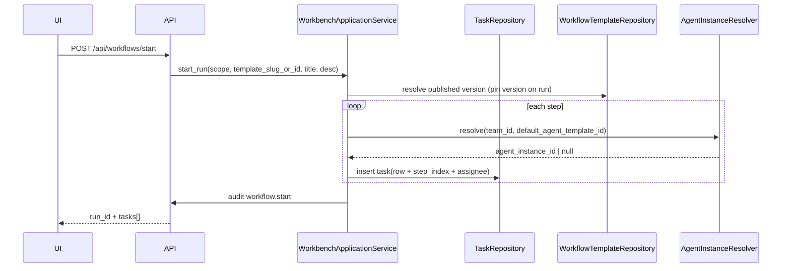

# 工作台需求 — 详细设计

| 项 | 内容 |
|----|------|
| 文档类型 | 架构详细设计（TDD） |
| 对应 PRD | [工作台需求-PRD.md](./工作台需求-PRD.md) |
| 开发计划 | [工作台需求-开发计划.md](./工作台需求-开发计划.md) |
| 状态 | Draft |

本文从架构师视角将 PRD 落实为：**逻辑边界、数据模型演进、关键流程、API 形态、权限与风险**。实现时可再拆「实现任务」与代码变更单。

---

## 1. 设计目标与约束

### 1.1 目标

- **单一事实来源（方向）**：任务与工作流元数据最终由 **持久化存储** 承载，替代「仅 `tasks.json`」的长期状态；过渡期允许适配层双读双写，但 API 契约以 **统一 DTO** 对外。
- **租户隔离**：所有列表与变更必须绑定 `tenant_id`，并按下发的 management scope 过滤 `organization_id` / `team_id`。
- **专家 / 业务分层**：模板与 Agent 定义的写入路径与业务任务路径在 **API 与 UI 路由** 上分离；服务端以 `AccessRequirement` 与角色枚举 enforce。
- **可演进**：先支持 **线性工作流模板** + **run 级任务组**；为项目实体、DAG、`task_kind`、artifact、CI 外链预留扩展位，避免再次分裂模型。

### 1.2 约束与非目标

- 本阶段 **不** 实现完整可视化 DAG 编排器；模板以内嵌 **有序步骤列表** + JSON 为主即可。
- **不** 在首版用 Agent Review 替代 CI；CI 状态为展示字段，权威在流水线。
- 与 PRD 一致：业务用户不可改工具白名单与工作流结构。

### 1.3 现状架构快照（实现锚点）

| 层次 | 现状 | 设计态度 |
|------|------|----------|
| Web 任务 CRUD / 看板 | `src/bin/web/task_service.rs` + `tasks.json` | 逐步迁出；保留适配器直至 cutover |
| 工作流模板 | `workflow_product_service.rs` 硬编码 | 迁到可配置存储 + 内置 fallback |
| SaaS 本地库 | `SaasSqliteStore`（`saas_tasks` 等） | 与 bee-web 打通时优先扩展 **同一套列语义** |
| Postgres | `migrations/0001_init_saas_schema.up.sql` 中 `tasks` | 云部署目标 schema；与 SQLite 用 **同一逻辑模型** 两套 DDL |
| 权限 | `require_management_access` + `MembershipRole` | 扩展 Expert 或 capability flag |

---

## 2. 逻辑架构

### 2.1 容器与职责

```text
┌─────────────────────────────────────────────────────────────────┐
│                        Web UI (web-ui)                          │
│  工作台 (/workbench/*)  │  平台管理 (/admin/* 或现有 tenants…)      │
└───────────────┬─────────────────────┬───────────────────────────┘
                │ HTTPS/JSON            │
┌───────────────▼─────────────────────▼───────────────────────────┐
│                    bee-web (Axum)                                 │
│  ┌──────────────────┐  ┌──────────────────┐  ┌──────────────────┐ │
│  │ Workbench API    │  │ Admin / SaaS API │  │ Task Execution   │ │
│  │ tasks, workflows │  │ templates, orgs  │  │ start, sessions  │ │
│  └────────┬─────────┘  └────────┬─────────┘  └────────┬─────────┘ │
│           │                     │                     │           │
│  ┌────────▼─────────────────────▼─────────────────────▼────────┐ │
│  │              WorkbenchApplicationService                       │ │
│  │  (编排：起 run、解析 assignee、子任务派生、审计打点)              │ │
│  └────────┬─────────────────────┬─────────────────────┬─────────┘ │
│           │                     │                     │           │
│  ┌────────▼─────────┐  ┌─────────▼─────────┐  ┌──────▼──────────┐ │
│  │ TaskRepository   │  │ WorkflowTemplate  │  │ AgentInstance │ │
│  │ (trait)          │  │ Repository         │  │ Resolver      │ │
│  └────────┬─────────┘  └─────────┬─────────┘  └──────┬──────────┘ │
└───────────┼──────────────────────┼───────────────────┼───────────┘
            │                      │                   │
┌───────────▼──────────────────────▼───────────────────▼───────────┐
│  Persistence: SQLite (saas_*) / Postgres (迁移 0001+) / 过渡期 JSON │
└──────────────────────────────────────────────────────────────────┘
            │
┌───────────▼──────────────────────────────────────────────────────┐
│  Agent Runtime: create_agent / Gateway session / tool_policy      │
└────────────────────────────────────────────────────────────────────┘
```

**WorkbenchApplicationService**（可渐进从 `server.rs` 内联逻辑抽出）：集中「起工作流 run」「按模板生成任务行」「解析 `agent_template_id` → `agent_instance_id`」「写 audit」「子任务派生命名空间」，避免路由层堆叠 if-else。

### 2.2 与 Vibecoding 的挂载点

- `task_kind`、artifacts、Review 报告、复盘链接作为 **任务扩展字段**（JSON 列或侧表），不侵入 ReAct 内核。
- 子任务派生走 **显式 API**（如 `POST /api/tasks/:id/spawn-children`），由服务层校验 scope 与父任务状态，再批量插入。

---

## 3. 领域模型

### 3.1 统一任务 DTO（API 与领域）

对外 JSON 与对内持久化之间使用 **同一结构**（字段名可 snake_case）。在现有 `task_service::Task` 基础上扩展，并与 DB 行双向映射。

| 字段 | 类型 | 说明 |
|------|------|------|
| `id` | UUID / string | 全局唯一 |
| `tenant_id`, `organization_id`, `team_id` | string | scope |
| `project_id` | optional string | M4；MVP 可空 |
| `title`, `description` | string, optional | |
| `status` | enum | 对齐：`todo` / `in_progress` / `done` + 可选 `blocked` / `cancelled`（若加需同步看板列） |
| `workflow_template_id` | optional | 逻辑 ID，非 DB 自增 |
| `workflow_template_version` | optional int | 钉版本 |
| `workflow_run_id` | optional string | 同 run 任务共享 |
| `template_step_index` | optional int | 模板第几步，便于排序与 UI |
| `assignee_agent_instance_ids` | string[] | 替换或并存于现有 `assignee_ids`；DB 可只存主 assignee + JSON 副列表 |
| `parent_task_id` | optional | 子任务树 |
| `task_kind` | optional enum string | PRD §11.2 |
| `artifacts` | JSON array | `{ "type", "uri", "label?" }` |
| `execution` | optional object | `correlation_id`, `last_session_id`, `linked_pr_url`, `ci_status` 等 |
| `review_report` | optional object | blocking / non_blocking / wont_fix / tech_debt（M5） |
| `created_at`, `updated_at` | RFC3339 | |

**Postgres `tasks` 表演进**（`0002_workbench_tasks.up.sql` 级）：在现有列上 `ALTER TABLE ADD COLUMN`：

- `workflow_run_id TEXT`, `workflow_template_id TEXT`, `workflow_template_version INT`
- `template_step_index INT`, `parent_task_id UUID REFERENCES tasks(id)`
- `task_kind VARCHAR(32)`, `artifacts JSONB`, `execution JSONB`, `review_report JSONB`
- `assignee_agent_id` 已存在；多 assignee 用 `assignees_json JSONB` 或仅保留单主 + 描述里补充

**SQLite `saas_tasks` 演进**：同样列名用 `TEXT` / `INTEGER` 存 JSON 字符串，与现有 `ensure_column` 模式一致。

**状态与 PG 默认值**：迁移里现有 `status` 默认 `pending`，与 JSON 任务 `todo` 需 **映射层** 统一（见 §6.1）。

### 3.2 工作流模板

新表（Postgres 示例；SQLite 用 `saas_workflow_templates` 镜像）：

**`workflow_templates`**

- `id` UUID PK  
- `tenant_id` UUID NOT NULL  
- `slug` VARCHAR(100) NOT NULL — 稳定键，如 `vibecoding_default`  
- `name`, `description`  
- `status` — `draft` | `published` | `archived`  
- `created_at`, `updated_at`  
- UNIQUE(`tenant_id`, `slug`)

**`workflow_template_versions`**

- `id` UUID PK  
- `template_id` UUID FK  
- `version` INT NOT NULL  
- `definition_json` JSONB NOT NULL — 见下  
- `published_at` TIMESTAMPTZ  
- UNIQUE(`template_id`, `version`)

**`definition_json` 结构（v1）**

```json
{
  "steps": [
    {
      "key": "requirement",
      "title": "需求定稿",
      "task_kind": "requirement",
      "default_agent_template_id": "uuid-or-null",
      "instructions": "可选，注入任务描述模板"
    }
  ],
  "team_filter": { "team_code": "optional" }
}
```

**内置模板**：代码保留 `BUILTIN_SALES_FOLLOWUP` 等 ID；加载时 **union**「DB 已发布 + 内置」，内置只读。与 PRD §6 #1 一致。

### 3.3 项目（M4）

**`projects`**

- `id`, `tenant_id`, `organization_id`, `team_id`, `name`, `description`
- `pinned_workflow_template_id`, `pinned_template_version` — 可选
- `created_at`, `updated_at`

任务表 `project_id` FK。MVP 可不建表，用 `workflow_run_id` 作弱项目；详细设计仍给出表结构便于迁移脚本一次写好。

### 3.4 子任务派生请求体（API）

```json
{
  "parent_task_id": "…",
  "idempotency_key": "hash-or-uuid",
  "children": [
    {
      "title": "…",
      "description": "…",
      "task_kind": "implement",
      "assignee_agent_instance_id": "…",
      "depends_on_task_ids": [],
      "acceptance_criteria": "…",
      "inherit_workflow_run_id": true
    }
  ]
}
```

服务端：校验父任务存在且 scope 匹配；`idempotency_key` 写入侧表或 `domain_events` payload，重复请求返回相同子任务 ID 列表。

---

## 4. 关键流程

### 4.1 启动工作流 run



**AgentInstanceResolver** 规则：

1. 输入 `(team_id, agent_template_id)`。  
2. 查询 `agent_instances` WHERE `team_id` = ? AND `template_id` = ? AND `status` = active LIMIT 1。  
3. 若无实例：任务仍创建，`assignee` 为空，UI 展示「需专家 bootstrap」；可选将第一步标为 `blocked`（产品决策）。

### 4.2 任务执行（start）

保持 `POST /api/tasks/:id/start` 语义；扩展：

- 将 `task.id` 与 **session** 或 **单次 headless run** 绑定，回写 `execution.last_session_id` / `correlation_id`（与 `tracing` span 对齐，可分阶段）。
- 执行前校验：`assignee` 对应实例的 `tool_policies` 已由运行时加载（与现有 Gateway / web 路径一致）。

### 4.3 Code Review 任务关闭（M5）

- 关闭条件（可配置）：`review_report.blocking` 为空 **且**（可选）人类在 `execution.human_approval_user_id` 上确认。
- `ci_status` 仅展示；**不**作为唯一关闭门槛，除非租户策略开启 `require_ci_green_to_close_review`。

### 4.4 复盘与 Lessons

- `task_kind = retro` 完成时，artifact 必须包含至少一条 `uri`；可选 webhook 通知。

---

## 5. API 设计（增量）

在现有路由上 **扩展**，避免破坏性改名；新版本可用 query `?v=2` 仅在必要时。

| 方法 | 路径 | 说明 |
|------|------|------|
| GET | `/api/workflow-templates` | 合并内置 + DB `published`；专家可见 draft 需另接口 |
| GET | `/api/admin/workflow-templates` | 专家：列表含 draft |
| POST | `/api/admin/workflow-templates` | 创建模板 + v1 draft |
| PATCH | `/api/admin/workflow-templates/:id` | 元数据 |
| POST | `/api/admin/workflow-templates/:id/versions` | 新版本 definition |
| POST | `/api/admin/workflow-templates/:id/publish` | 发布指定 version |
| POST | `/api/workflows/start` | body 增加可选 `template_version`；内部解析 DB |
| GET | `/api/tasks` | 过滤：`workflow_run_id`, `task_kind`, `project_id` |
| POST | `/api/tasks/:id/spawn-children` | 子任务派生 + idempotency |
| PATCH | `/api/tasks/:id` | 允许更新 `artifacts`, `execution`, `review_report`（scope + 角色校验） |
| GET | `/api/task-board` | 数据源改为 Repository；列可增 `blocked` |

**权限矩阵（摘要）**

| 操作 | Member | TeamAdmin | OrgAdmin | Expert/Platform |
|------|--------|-----------|----------|-----------------|
| 看板/列表本团队 | ✓ | ✓ | ✓ | ✓（若 scope） |
| 创建任务 / 起 run | ✓ | ✓ | ✓ | ✓ |
| 改他人任务状态 | 按策略 | ✓ | ✓ | ✓ |
| CRUD 工作流模板 | ✗ | ✗ | 可选 | ✓ |
| 发布模板 | ✗ | ✗ | ✗ | ✓ |

*Expert 角色实现二选一：* `MembershipRole` 新增枚举值，或 `OrgAdmin` + `membership.metadata_json.expert = true`。*推荐* 显式枚举便于审计。

---

## 6. 数据迁移与兼容策略

### 6.1 双轨收敛（M3）

**阶段 A**：`TaskRepository` 接口 + `JsonTaskRepository`（当前文件）+ `SqlTaskRepository`（SQLite/Postgres）。

**阶段 B**：写路径双写（JSON + SQL），读路径可配置 `TASK_SOURCE=sql|json|dual_merge`。

**阶段 C**：下线 JSON，导入脚本将历史 `tasks.json` 并入 SQL（已有 `migration.rs` import 可参考）。

**状态映射**

| tasks.json | PG tasks.status |
|------------|-----------------|
| todo | pending |
| in_progress | in_progress（需 ALTER 允许或统一用 varchar） |
| done | completed（或 done，二选一全局统一） |

在映射层单一函数 `task_status_to_api` / `task_status_from_db` 固化。

### 6.2 Postgres vs SQLite

- **逻辑模型一致**；DDL 分文件维护：`migrations/0002_*.sql`（Postgres）与 `saas/sqlite.rs` 的 `ensure_column` / 新 `CREATE TABLE`。  
- CI 建议：`sqlx migrate` 或文档要求手工对齐检查表。

---

## 7. 前端信息架构（M1）

- 路由分组：`/workbench`（Dashboard、Runs、Task 详情）与 `/admin`（现有 Tenants、Teams、**WorkflowTemplates** 新页）。  
- `Workflows.tsx` 逻辑迁入 `workbench/Runs.tsx` 或重导出，导航文案「工作台」。  
- Scope：`ADMIN_SCOPE_CHANGED_EVENT` 不变；workbench layout 强依赖 team 时提示选择团队。

---

## 8. 非功能设计

| 主题 | 设计要点 |
|------|----------|
| 审计 | `workflow.start`、`task.spawn_children`、`workflow_template.publish`；`detail_json` 含 template_version、task_ids |
| 幂等 | `spawn-children` 使用 `idempotency_key`；`workflows/start` 可选 client `Idempotency-Key` header |
| 性能 | 看板查询按 `(tenant_id, team_id, status)` 复合索引；run 下列任务按 `workflow_run_id` + `template_step_index` |
| 安全 | 模板 definition 内禁止执行任意代码；仅 JSON schema 校验；专家接口防 XSS 于 UI |
| 可观测 | `execution.correlation_id` 贯穿 HTTP → Agent run → tracing |

---

## 9. 里程碑映射（实现顺序）

| PRD 里程碑 | 设计交付物 |
|------------|------------|
| M1 | 路由分组 + Workbench 空壳页；无后端大改 |
| M2 | `workflow_templates` + versions DDL；Resolver；`start` 走 DB；API 兼容旧 template_id |
| M3 | `TaskRepository` + SQL 主读；状态映射；双写切换开关 |
| M4 | `projects` 表；`spawn-children`；`parent_task_id` |
| M5 | `task_kind` / artifacts / review_report / CI 展示字段 |

---

## 10. 风险与开放决策

| 风险 | 缓解 |
|------|------|
| 双写窗口数据不一致 | 缩短窗口 + 只读校验 job + feature flag |
| UUID 字符串在 JSON 与 PG 混用 | API 层统一 string；DB 内 PG 用 UUID 类型 |
| Gateway 与 web `start` 行为分叉 | 抽取共享 `bind_task_to_session` 小模块 |
| Expert 角色与 OrgAdmin 重叠 | 产品定稿后写死矩阵，避免每接口自定义 |

**待产品确认**（延续 PRD §10）：会话与任务 1:1 还是多对多；Review 是否强制人类审批。

---

## 11. 参考索引

- PRD：[工作台需求-PRD.md](./工作台需求-PRD.md)
- 运行时任务：`src/bin/web/task_service.rs`、`src/bin/web/workflow_product_service.rs`
- Web 路由：`src/bin/web/server.rs`
- SaaS SQLite：`src/saas/sqlite.rs`（`saas_tasks`）
- SaaS 模型：`src/saas/models.rs`
- Postgres：`migrations/0001_init_saas_schema.up.sql`
- 任务导入：`src/saas/migration.rs`
